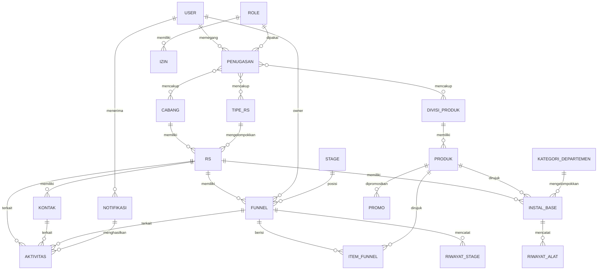

# PRD — MHJ CRM (Sales Management Alat Kesehatan)

| | |
|---|---|
| **Versi** | 0.2 (draf untuk review stakeholder) |
| **Tanggal** | 3 Oktober 2026 |
| **Nama kerja produk** | MHJ CRM (mengikuti nama repo `MHJ_CRMNew`) |
| **Sumber** | Dokumen kebutuhan stakeholder (`APLIKASI ERP.pdf`), jawaban klarifikasi 3 Oktober 2026, bagan role, tabel stage, mockup beranda aplikasi Android, repo frontend `MHJ_CRMNew` |

**Riwayat perubahan**

| Versi | Perubahan |
|---|---|
| 0.1 | Draf awal |
| 0.2 | Menambah konteks warna dari mockup beranda (10.2), susunan dan hierarki visual sesuai repo (10.3), serta OQ-29 dan OQ-30 |

**Cara membaca dokumen ini**

- Setiap requirement punya ID unik (mis. `DSH-01`, `RS-03`, `PIP-05`). Lampiran A memetakan setiap butir dokumen sumber ke ID-nya.
- `[TBD → OQ-xx]` berarti belum diputuskan dan merujuk ke pertanyaan di Bagian 13. Requirement bertanda TBD belum boleh dikerjakan sampai pertanyaannya dijawab.
- Tulisan **"Usulan"** adalah saran penyusun PRD, bukan keputusan stakeholder, dan perlu dikonfirmasi.

---

## 1. Ringkasan & Tujuan Produk

MHJ CRM adalah aplikasi CRM/sales management untuk tim sales alat kesehatan yang menjual ke rumah sakit (RS). Aplikasi tersedia sebagai **web** dan **aplikasi Android (Flutter)**, dengan data master yang sama dengan sistem finance **Go500**.

**Tujuan produk**

| # | Tujuan | Modul terkait |
|---|---|---|
| T1 | Setiap user hanya melihat dan mengelola data sesuai role, cabang, divisi produk, dan tipe RS-nya | Hak Akses |
| T2 | Kinerja penjualan terlihat dalam satu layar: target vs omset, win rate, funnel linearity, backlog, market coverage | Dashboard |
| T3 | Informasi satu RS (funnel, alat terpasang, kontak, aktivitas, kesehatan finansial) terbaca cepat dan dapat ditindaklanjuti | Detil RS |
| T4 | Pipeline tetap terbaca saat funnel banyak, dengan stage, probabilitas, dan konversi yang jelas | Pipeline |
| T5 | Tindak lanjut tidak terlewat: notifikasi berujung pada task, panggilan, atau catatan | Notifikasi, Task |
| T6 | Data customer dan produk identik dengan Go500, tanpa input ganda | Data Pelanggan, Integrasi |

**Cakupan organisasi:** 10 cabang — Medan, Pekanbaru, Jakarta-Lampung, Bandung, Solo, Surabaya, Kalimantan, Bali Nusra, Makassar, Maluku Papua.

---

## 2. Latar Belakang Masalah & Success Metrics

### 2.1 Masalah yang dinyatakan stakeholder

| # | Masalah | Dampak |
|---|---|---|
| M1 | Hak akses perlu mengikuti role, cabang, divisi produk, dan tipe RS sekaligus; satu orang bisa memegang beberapa cabang/divisi/tipe RS | Tanpa ini data antar cabang/divisi tercampur atau user tidak melihat data yang menjadi tanggung jawabnya |
| M2 | Dashboard belum memuat metrik kunci (funnel linearity, win rate per divisi, backlog, market coverage, peta RS) | Manajer dan manajemen tidak punya gambaran kinerja yang utuh |
| M3 | Halaman Detil RS monoton dan kaku (hanya teks seperti "RS swasta, 1 funnel, 1 alat, 2 kontak") | Informasi penting RS sulit ditangkap sekilas |
| M4 | Pipeline memanjang ke bawah dan sulit dipakai saat funnel banyak; warna stage samar | Sales dan manajer sulit memantau funnel |
| M5 | Keterangan waktu funnel ("2 hari lalu") tidak jelas maknanya | Funnel yang lama tidak diurus tidak terdeteksi dengan benar |
| M6 | Belum ada probabilitas dan konversi per stage | Kualitas pipeline tidak terukur |
| M7 | Notifikasi belum punya aksi tindak lanjut | Pesan dibaca tetapi tidak berujung tindakan |
| M8 | Instal base belum dikelompokkan, belum ada riwayat alat dan peringatan usia alat | Peluang penggantian/upgrade alat terlewat |
| M9 | Istilah "Leads" tidak sesuai; yang dimaksud adalah "Kontak" | Kebingungan istilah di lapangan |
| M10 | Data pelanggan belum memuat garansi dan status PPN; data customer/produk harus sama dengan Go500 | Risiko data tidak konsisten antara sales dan finance |

### 2.2 Success metrics (KPI)

Stakeholder belum menetapkan KPI keberhasilan produk. Tabel berikut adalah **usulan**; seluruh angka target `[TBD → OQ-26]`.

**KPI produk (mengukur apakah aplikasinya berhasil)**

| KPI | Definisi | Target |
|---|---|---|
| Adopsi | User aktif mingguan ÷ user terdaftar | `[TBD]` |
| Kesegaran pipeline | Funnel aktif yang diupdate dalam N hari terakhir ÷ total funnel aktif | `[TBD]` |
| Kelengkapan funnel | Funnel aktif yang punya nilai, produk, dan probabilitas ÷ total funnel aktif | `[TBD]` |
| Tindak lanjut notifikasi | Notifikasi funnel yang menghasilkan task/call/notes ÷ notifikasi funnel terkirim | `[TBD]` |
| Konsistensi master | Jumlah selisih data customer/produk antara CRM dan Go500 | 0 |
| Kecepatan dashboard | Waktu muat dashboard (lihat NFR-01) | `[TBD]` |

**KPI bisnis (diukur oleh aplikasi; definisi di Bagian 6):** pencapaian target, win rate, funnel linearity, backlog, konversi per stage, market coverage.

---

## 3. Persona & Hak Akses

### 3.1 Struktur role (sesuai bagan dari stakeholder)

```
BDM/BDE
├── Branch Manager/Deputy BM
│   └── Product Specialist
│       └── Sales Area
└── Application Specialist
```

### 3.2 Persona

| Persona | Posisi di bagan | Kebutuhan utama |
|---|---|---|
| **Sales Area** | Paling bawah, di bawah Product Specialist | Mengelola kontak, funnel, dan task harian; menindaklanjuti notifikasi; melihat pencapaian sendiri |
| **Product Specialist** | Di bawah Branch Manager/Deputy BM | Memantau funnel dan instal base untuk divisi produknya |
| **Application Specialist** | Sejajar Branch Manager, di bawah BDM/BDE | `[TBD → OQ-01]` kebutuhan dan cakupan aksesnya belum dijelaskan |
| **Branch Manager/Deputy BM** | Di bawah BDM/BDE | Memantau pipeline dan kinerja cabang, mendorong tindak lanjut tim |
| **BDM/BDE** | Puncak bagan | Memantau kinerja lintas cabang |
| **Manajemen** | Tidak ada di bagan `[TBD → OQ-01]` | Dashboard manajemen (DSH-10) |
| **Finance** | Tidak ada di bagan `[TBD → OQ-01]` | Menetapkan kriteria grading kesehatan finansial RS (RS-02) |

Konteks awal menyebut pengguna "sales, manajer cabang, manajemen, dan finance", sedangkan bagan role hanya memuat lima kotak di atas. Posisi Manajemen, Finance, dan pengelola akses (admin) perlu ditetapkan (OQ-01).

### 3.3 Dimensi hak akses

Hak akses ditentukan oleh empat dimensi:

| Dimensi | Sumber master | Nilai |
|---|---|---|
| Role/jabatan | Database CRM (dibuat sendiri) | Sesuai bagan 3.1 |
| Cabang | Go500 | 10 cabang |
| Divisi produk | Go500 | mis. MRI, USG |
| Tipe RS | Go500 | Government, Private |

**Aturan yang sudah ditetapkan stakeholder:** satu orang dapat memegang role di beberapa cabang, beberapa divisi produk, dan beberapa tipe RS sekaligus.

> **Contoh:** Fuad ber-role Sales di cabang Jakarta-Lampung dan Surabaya, divisi MRI dan USG, tipe RS Government. Fuad melihat data RS Government di kedua cabang itu untuk produk MRI dan USG. Ia tidak melihat RS Private, cabang lain, atau divisi lain.

### 3.4 Role matrix (draf)

Stakeholder baru menetapkan struktur role dan dimensi cakupan. Izin per fitur belum ditetapkan, sehingga matriks ini adalah **usulan untuk direview** (OQ-02).

Legenda: ✔ = sudah pasti dari kebutuhan · ◐ = usulan · ? = belum ada dasar untuk mengusulkan · ✘ = tidak diizinkan

| Kemampuan | BDM/BDE | BM/Deputy BM | Application Specialist | Product Specialist | Sales Area |
|---|:-:|:-:|:-:|:-:|:-:|
| Melihat data sebatas cakupan penugasan (cabang × divisi × tipe RS) | ✔ | ✔ | ✔ | ✔ | ✔ |
| Melihat data milik user lain di dalam cakupannya | ◐ | ◐ | ? | ◐ | ? |
| Membuat/mengubah kontak, funnel, task | ? | ◐ | ? | ◐ | ✔ |
| Memindahkan stage dan mengisi probabilitas funnel miliknya | ? | ? | ? | ◐ | ✔ |
| Mengirim notifikasi dari detil funnel ke owner | ◐ | ◐ | ? | ◐ | ? |
| Dashboard sales (cakupan sendiri) | ◐ | ◐ | ◐ | ◐ | ◐ |
| Dashboard manajemen | ? | ? | ? | ? | ? |
| Mengelola role dan penugasan user | ? | ? | ? | ? | ? |
| Mengatur batas usia alat | ? | ? | ? | ? | ? |
| Mengubah data master customer/produk | ✘ | ✘ | ✘ | ✘ | ✘ |

Data master customer/produk tidak dapat diubah oleh role mana pun karena berasal dari Go500 (PLG-01, PLG-02). Manajemen dan Finance belum punya kolom karena belum ditetapkan sebagai role (OQ-01).

---

## 4. Ruang Lingkup & Prioritas

### 4.1 In-scope

- Modul: Hak Akses, Dashboard, Detil RS, Pipeline, Kontak, Data Pelanggan/Produk, Task/Aktivitas, Notifikasi, Chat realtime.
- Platform: web (Vue) dan aplikasi Android (Flutter), keduanya memakai backend yang sama.
- Integrasi baca dari database Go500 untuk cabang, divisi produk, tipe RS, customer, dan produk.

### 4.2 Out-of-scope

- Menulis atau mengubah data di Go500 dari CRM.
- Proses finance (penagihan, invoice, pembayaran). CRM hanya menampilkan hasilnya bila datanya tersedia.
- Notifikasi lewat email atau WhatsApp. Kanal yang ditetapkan hanya in-app dan in-web.
- Aplikasi iOS `[TBD → OQ-22]`.
- Menu Stok Barang, Kalkulator, Kampanye, Materi Dokumen, dan Laporan yang tampil di mockup beranda. Menu ini tidak ada di dokumen kebutuhan `[TBD → OQ-30]`.
- Pencatatan servis/perbaikan alat. CRM hanya menampilkan riwayat alat; sumber datanya `[TBD → OQ-08]`.

### 4.3 Prioritas MoSCoW (usulan)

| Prioritas | Requirement | Alasan |
|---|---|---|
| **Must** | AKS-01 s.d. AKS-06, INT-01 s.d. INT-04, PLG-01, PLG-02, TSK-01, KTK-01, KTK-03, RS-01, RS-03, RS-04, RS-07, RS-08, PIP-01 s.d. PIP-05, DSH-01 s.d. DSH-04, DSH-12, NTF-01, NTF-02 | Fondasi: tanpa akses, master, pipeline, dan task, modul lain tidak bisa dipakai |
| **Should** | AKS-07, PIP-06, PIP-07, DSH-05, DSH-06, DSH-07, DSH-08, DSH-09, DSH-11, RS-05, RS-06, KTK-02, PLG-03, PLG-04, INT-05, NTF-03, CHT-01 | Nilai tinggi, tetapi bergantung pada fondasi atau pada jawaban Open Questions |
| **Could** | DSH-10, RS-02, NTF-04, CHT-02 | Definisinya belum lengkap (daftar metrik manajemen, keputusan Finance, ruang lingkup chat) |
| **Won't (rilis ini)** | Tulis balik ke Go500, iOS, notifikasi email/WhatsApp | Di luar kebutuhan yang dinyatakan |

Prioritas ini perlu disetujui stakeholder. Item yang definisinya masih TBD otomatis naik prioritas begitu pertanyaannya terjawab.

---
## 5. Kebutuhan Fungsional per Modul

Setiap fitur memuat: user story, deskripsi, acceptance criteria (Given/When/Then), aturan bisnis/formula, dan edge case. Label `[Must]`, `[Should]`, `[Could]` mengikuti Bagian 4.3.

### 5.1 Hak Akses (AKS)

#### AKS-01 — Master role/jabatan dan hierarki `[Must]`

- **User story:** Sebagai pengelola akses, saya ingin mengelola daftar role beserta atasan langsungnya, agar hak akses mengikuti struktur organisasi.
- **Deskripsi:** Master role disimpan di database CRM, tidak diambil dari Go500. Isi awal mengikuti bagan 3.1.
- **Acceptance criteria:**
  - **Given** pengelola akses membuka master role, **When** ia menambah atau mengubah role dan atasan langsungnya, **Then** perubahan tersimpan dan tercatat di audit log.
  - **Given** sebuah role masih dipakai oleh penugasan aktif, **When** role itu dihapus, **Then** sistem menolak dan menampilkan jumlah user yang terdampak.
- **Aturan bisnis:**
  - Nama role unik. Setiap role punya tepat satu atasan langsung, kecuali role puncak.
  - Role awal: BDM/BDE, Branch Manager/Deputy BM, Application Specialist, Product Specialist, Sales Area.
  - Apakah "BDM/BDE" dan "Branch Manager/Deputy BM" masing-masing satu role atau dua role terpisah, serta role untuk Manajemen, Finance, dan pengelola akses: `[TBD → OQ-01]`.
- **Edge case:** hierarki melingkar ditolak; role dinonaktifkan (bukan dihapus) agar riwayat tetap utuh.

#### AKS-02 — Penugasan user ke banyak cabang, divisi, dan tipe RS `[Must]`

- **User story:** Sebagai pengelola akses, saya ingin menetapkan role seorang user beserta cabang, divisi produk, dan tipe RS yang dipegangnya (masing-masing boleh lebih dari satu), agar cakupan datanya sesuai tanggung jawabnya.
- **Deskripsi:** Satu *penugasan* terdiri dari satu role dan himpunan cabang, divisi produk, serta tipe RS. Pilihan cabang, divisi, dan tipe RS diambil dari master Go500.
- **Acceptance criteria:**
  - **Given** Fuad ditugaskan sebagai Sales di cabang Jakarta-Lampung dan Surabaya, divisi MRI dan USG, tipe RS Government, **When** Fuad membuka daftar funnel, **Then** yang tampil hanya funnel dari RS Government di kedua cabang itu dengan produk divisi MRI atau USG.
  - **Given** penugasan seorang user diubah, **When** user itu meminta data berikutnya, **Then** cakupan baru sudah berlaku di web dan Android.
  - **Given** user belum punya penugasan, **When** ia login, **Then** ia melihat pesan bahwa aksesnya belum diatur dan tidak ada data yang tampil.
- **Aturan bisnis:**
  - Di dalam satu penugasan, antar dimensi berlaku **DAN**; antar nilai di dimensi yang sama berlaku **ATAU**. Contoh Fuad: (Jakarta-Lampung ATAU Surabaya) DAN (MRI ATAU USG) DAN (Government).
  - Setiap dimensi wajib berisi minimal satu nilai.
  - Apakah satu user boleh punya role berbeda di cabang berbeda (mis. Sales di Surabaya, Product Specialist di Solo): `[TBD → OQ-03]`. Model penugasan di atas sudah menampung kedua kemungkinan.
- **Edge case:** cabang/divisi dinonaktifkan di Go500 saat masih dipakai penugasan; user pindah cabang dan funnel lamanya perlu dialihkan; dua penugasan yang cakupannya tumpang tindih.

#### AKS-03 — Penyaringan data sesuai cakupan `[Must]`

- **User story:** Sebagai manajemen, saya ingin setiap user hanya mengakses data dalam cakupannya, agar data antar cabang dan divisi tidak bocor.
- **Deskripsi:** Cakupan diterapkan di sisi server secara seragam untuk web dan Android, pada daftar, detail, dashboard, peta, pencarian, ekspor, notifikasi, dan chat.
- **Acceptance criteria:**
  - **Given** user tanpa akses cabang Medan, **When** ia membuka tautan langsung ke Detil RS cabang Medan, **Then** akses ditolak dan percobaan itu tercatat di audit log.
  - **Given** user dengan cakupan tertentu, **When** dashboard dihitung, **Then** semua angka hanya memakai data dalam cakupannya.
- **Aturan bisnis:** dimensi yang tidak relevan bagi suatu entitas diabaikan.

  | Entitas | Dimensi yang diperiksa |
  |---|---|
  | RS, Kontak | Cabang, tipe RS |
  | Funnel, Instal base | Cabang, tipe RS (dari RS-nya) dan divisi (dari produknya) |
  | Produk, Promo, Training | Divisi |

- **Edge case:** funnel berisi produk dari beberapa divisi, sebagian di luar cakupan user `[TBD → OQ-02]`; RS berpindah cabang di Go500; data tanpa divisi.

#### AKS-04 — Visibilitas mengikuti hierarki `[Must]`

- **User story:** Sebagai Branch Manager, saya ingin melihat funnel dan aktivitas tim saya, agar bisa memantau dan mendorong tindak lanjut.
- **Deskripsi:** Menentukan apakah user hanya melihat data miliknya atau juga milik user lain dalam cakupannya.
- **Acceptance criteria:**
  - **Given** aturan visibilitas tiap role sudah ditetapkan, **When** user membuka pipeline, **Then** ia melihat funnel sesuai aturan role-nya dan tidak melihat yang lain.
  - **Given** user melihat funnel milik user lain, **When** ia membukanya, **Then** nama owner tampil jelas.
- **Aturan bisnis:** `[TBD → OQ-02]`. Usulan: Sales Area melihat data miliknya sendiri; role di atasnya melihat semua data di dalam cakupan penugasannya.
- **Edge case:** atasan dengan cakupan divisi lebih sempit daripada bawahannya; posisi kosong di tengah hierarki.

#### AKS-05 — Izin fitur per role `[Must]`

- **User story:** Sebagai pengelola akses, saya ingin mengatur aksi yang boleh dilakukan tiap role (lihat, buat, ubah, hapus, ekspor) per modul, agar tiap role hanya bisa melakukan pekerjaannya.
- **Deskripsi:** Matriks izin dapat diatur tanpa perubahan aplikasi. Isi awal mengikuti hasil review Bagian 3.4.
- **Acceptance criteria:**
  - **Given** role tanpa izin ubah funnel, **When** user ber-role itu membuka detil funnel, **Then** tombol ubah tidak tampil dan permintaan ubah ditolak server.
  - **Given** izin sebuah role diubah, **When** tersimpan, **Then** perubahan tercatat di audit log dengan nilai sebelum dan sesudah.
- **Aturan bisnis:** izin diperiksa di server, bukan hanya disembunyikan di layar. Isi matriks `[TBD → OQ-02]`.
- **Edge case:** user dengan beberapa penugasan ber-role berbeda mendapat izin sesuai role pada cakupan data yang sedang dibuka.

#### AKS-06 — Login dan sesi `[Must]`

- **User story:** Sebagai user, saya ingin login di web dan aplikasi Android dengan akun yang sama, agar bisa bekerja di kantor maupun lapangan.
- **Deskripsi:** Satu akun untuk kedua platform.
- **Acceptance criteria:**
  - **Given** kredensial benar dan akun aktif, **When** user login, **Then** ia masuk ke dashboard sesuai cakupannya.
  - **Given** akun dinonaktifkan, **When** user masih punya sesi aktif, **Then** sesi diputus pada permintaan berikutnya.
- **Aturan bisnis:** sumber akun (dibuat di CRM atau mengikuti sistem lain), metode login, dan kebijakan kata sandi `[TBD → OQ-04]`.
- **Edge case:** login di beberapa perangkat sekaligus; lupa kata sandi; percobaan login gagal berulang.

#### AKS-07 — Filter cakupan untuk user multi-cabang/divisi `[Should]`

- **User story:** Sebagai user yang memegang beberapa cabang atau divisi, saya ingin mempersempit tampilan ke satu cabang, divisi, atau tipe RS, agar bisa fokus.
- **Deskripsi:** Filter cabang, divisi, dan tipe RS tersedia di dashboard dan daftar.
- **Acceptance criteria:**
  - **Given** Fuad memegang Jakarta-Lampung dan Surabaya, **When** ia memilih Surabaya, **Then** semua widget dan daftar hanya menampilkan data Surabaya.
  - **Given** filter dibuka, **Then** pilihan yang tersedia hanya nilai di dalam cakupan user.
- **Aturan bisnis:** default menampilkan gabungan seluruh cakupan user.
- **Edge case:** user dengan satu cabang tidak perlu melihat filter cabang.

---

### 5.2 Dashboard (DSH)

Semua widget dashboard tunduk pada AKS-03 dan filter global DSH-12.

#### DSH-01 — Target vs omset `[Must]`

- **User story:** Sebagai sales atau manajer, saya ingin melihat pencapaian omset terhadap target, agar tahu posisi saya pada periode berjalan.
- **Deskripsi:** Kartu dan grafik yang membandingkan target dan omset per periode.
- **Acceptance criteria:**
  - **Given** target dan omset tersedia untuk periode terpilih, **When** dashboard dibuka, **Then** tampil nilai target, omset, persentase pencapaian, dan selisihnya.
  - **Given** filter cabang atau divisi diubah, **Then** angka dihitung ulang sesuai filter.
- **Formula:** Pencapaian (%) = omset ÷ target × 100. Sumber target dan definisi omset `[TBD → OQ-06, OQ-12]`.
- **Edge case:** target kosong atau nol menampilkan "Target belum diatur", bukan hasil pembagian nol; pencapaian di atas 100%; user multi-cabang melihat angka gabungan.

#### DSH-02 — Win vs lost `[Must]`

- **User story:** Sebagai manajer, saya ingin membandingkan funnel yang menang dan kalah, agar tahu kualitas penutupan tim.
- **Deskripsi:** Perbandingan funnel Closed Won dan Closed Lost pada periode terpilih, dalam jumlah dan nilai.
- **Acceptance criteria:**
  - **Given** ada funnel yang ditutup pada periode terpilih, **When** dashboard dibuka, **Then** tampil jumlah dan nilai Closed Won serta Closed Lost.
  - **Given** user mengklik salah satu sisi, **Then** terbuka daftar funnel terkait.
- **Aturan bisnis:** periode dihitung dari tanggal funnel ditutup. Perlakuan Closed Cancel (ditampilkan terpisah atau tidak dihitung) `[TBD → OQ-15]`.
- **Edge case:** periode tanpa penutupan menampilkan keadaan kosong; funnel yang dibuka kembali setelah ditutup.

#### DSH-03 — Project aktif `[Must]`

- **User story:** Sebagai sales, saya ingin melihat jumlah project aktif saya, agar tahu beban pipeline saat ini.
- **Deskripsi:** Jumlah dan total nilai funnel yang belum ditutup, dengan rincian per stage.
- **Acceptance criteria:**
  - **Given** ada funnel pada stage terbuka, **When** dashboard dibuka, **Then** tampil jumlah, total nilai, dan rincian per stage.
  - **Given** user mengklik kartu, **Then** pipeline terbuka dengan filter yang sama.
- **Aturan bisnis:** project aktif = funnel pada stage Qualified, Presentation/Demo, Quotation, atau Negotiation.
- **Edge case:** tidak ada project aktif; funnel tanpa nilai tetap dihitung di jumlah.

#### DSH-04 — Persentase menang dan win rate global (drill-down per divisi) `[Must]`

- **User story:** Sebagai manajer, saya ingin melihat win rate keseluruhan dan per divisi, agar tahu divisi mana yang paling efektif.
- **Deskripsi:** Kartu win rate global. Saat diklik, tampil win rate per divisi produk berbasis qty. Dokumen sumber menyebut "persentase menang" dan "win rate global" sebagai dua butir; keduanya digabung di sini sampai dipastikan berbeda (OQ-09).
- **Acceptance criteria:**
  - **Given** kartu win rate global tampil, **When** diklik, **Then** tampil win rate per divisi berbasis qty, hanya untuk divisi dalam cakupan user.
  - **Given** sebuah divisi tidak punya funnel pada periode itu, **Then** nilainya tampil "–", bukan 0%.
- **Formula:** Win rate = PO ÷ funnel. Pembagi, satuan qty, dan periode `[TBD → OQ-09]`.
- **Edge case:** funnel nol; satu funnel dengan beberapa produk dari divisi berbeda.

#### DSH-05 — Market coverage `[Should]`

- **User story:** Sebagai manajer, saya ingin tahu seberapa luas pasar yang sudah digarap, agar bisa mengarahkan tim ke RS yang belum tersentuh.
- **Deskripsi:** Persentase cakupan pasar dalam cakupan user.
- **Acceptance criteria:**
  - **Given** definisi market coverage sudah ditetapkan, **When** dashboard dibuka, **Then** persentase tampil beserta pembilang dan penyebutnya.
  - **Given** user mengklik widget, **Then** tampil daftar RS yang belum tercakup.
- **Formula:** `[TBD → OQ-11]`.
- **Edge case:** RS baru muncul di Go500 di tengah periode; RS nonaktif.

#### DSH-06 — Funnel linearity `[Should]`

- **User story:** Sebagai manajer, saya ingin membandingkan funnel yang masuk dan yang menang dengan kebutuhan funnel bulanan, agar tahu apakah pipeline cukup untuk mencapai target.
- **Deskripsi:** Grafik bulanan dengan tiga nilai: acuan funnel, total project yang diinput, dan total project Win.
- **Acceptance criteria:**
  - **Given** total target T, **When** widget dibuka, **Then** garis acuan bernilai T × 3 ÷ 12 dan setiap bulan menampilkan total project yang diinput serta total project Win.
  - **Given** user mengklik satu bulan, **Then** tampil daftar funnel yang membentuk angka bulan itu.
- **Formula:** Acuan funnel bulanan = total target × 3 ÷ 12. Level target, satuan (Rupiah atau jumlah), dan apakah faktor 3 dapat diatur `[TBD → OQ-10]`.
- **Edge case:** target berubah di tengah tahun; bulan berjalan belum penuh; funnel yang diinput lalu dibatalkan.

#### DSH-07 — Promo dalam bentuk kartu gambar produk `[Should]`

- **User story:** Sebagai sales, saya ingin melihat promo yang berlaku sebagai gambar produk, agar cepat mengenali dan menawarkannya.
- **Deskripsi:** Tampilan promo diubah menjadi kotak-kotak gambar produk dengan keterangan promo.
- **Acceptance criteria:**
  - **Given** ada promo aktif, **When** dashboard dibuka, **Then** tiap promo tampil sebagai kartu berisi gambar produk dan keterangan promo.
  - **Given** masa berlaku promo sudah lewat, **Then** promo tidak tampil.
- **Aturan bisnis:** hanya promo untuk divisi dalam cakupan user. Sumber data dan pengelola promo `[TBD → OQ-24]`.
- **Edge case:** promo tanpa gambar memakai gambar pengganti; jumlah promo melebihi ruang layar.

#### DSH-08 — Calendar training (top 5) `[Should]`

- **User story:** Sebagai sales, saya ingin melihat jadwal training, agar bisa menyiapkan diri dan mengajak customer.
- **Deskripsi:** Menampilkan lima training.
- **Acceptance criteria:**
  - **Given** ada lebih dari lima training, **When** dashboard dibuka, **Then** hanya lima yang tampil dengan tautan untuk melihat semua.
  - **Given** tidak ada training, **Then** tampil keadaan kosong.
- **Aturan bisnis:** dasar pemilihan lima training dan sumber datanya `[TBD → OQ-24]`. Usulan: lima training terdekat yang akan datang.
- **Edge case:** kurang dari lima training; training yang sedang berlangsung hari ini.

#### DSH-09 — Backlog `[Should]`

- **User story:** Sebagai manajer, saya ingin melihat order yang belum menjadi sales, agar tahu nilai yang masih tertahan.
- **Deskripsi:** Kartu backlog dengan rincian yang bisa dibuka.
- **Acceptance criteria:**
  - **Given** data order dan sales tersedia, **When** dashboard dibuka, **Then** backlog tampil sebagai order dikurangi sales.
  - **Given** user mengklik kartu, **Then** tampil rincian pembentuk backlog.
- **Formula:** Backlog = order − sales. Definisi order dan sales, satuan, dan sumber data `[TBD → OQ-06, OQ-12]`.
- **Edge case:** sales lebih besar dari order pada suatu periode; order dibatalkan.

#### DSH-10 — Dashboard manajemen `[Could]`

- **User story:** Sebagai manajemen, saya ingin dashboard khusus, agar bisa memantau penjualan perusahaan.
- **Deskripsi:** Dashboard terpisah untuk manajemen. Metrik yang sudah disebut hanya penjualan; daftar di dokumen sumber terpotong.
- **Acceptance criteria:**
  - **Given** user berhak atas dashboard manajemen, **When** membukanya, **Then** tampil metrik penjualan dan metrik lain yang ditetapkan.
  - **Given** user tidak berhak, **Then** menu dashboard manajemen tidak tampil.
- **Aturan bisnis:** daftar metrik, perbandingan antar cabang/divisi, dan kebutuhan ekspor `[TBD → OQ-13]`. Role yang berhak `[TBD → OQ-01]`.
- **Edge case:** manajemen dengan cakupan terbatas pada sebagian cabang.

#### DSH-11 — Peta RS dengan dua mode `[Should]`

- **User story:** Sebagai manajer, saya ingin melihat RS di peta berdasarkan frekuensi visit atau frekuensi penjualan, agar tahu wilayah yang kurang digarap.
- **Deskripsi:** Peta RS dengan dua mode yang bisa diganti: frekuensi visit dan frekuensi penjualan per RS.
- **Acceptance criteria:**
  - **Given** mode Visit dipilih, **When** peta tampil, **Then** tiap RS dalam cakupan user ditandai dengan intensitas sesuai jumlah visit pada periode terpilih.
  - **Given** mode Penjualan dipilih, **Then** intensitas mengikuti frekuensi penjualan per RS.
  - **Given** user mengklik penanda RS, **Then** tampil ringkasan RS dan tautan ke Detil RS.
- **Aturan bisnis:** visit = aktivitas bertipe kunjungan (OQ-17). Definisi frekuensi penjualan, periode, dan sumber koordinat RS `[TBD → OQ-25]`.
- **Edge case:** RS tanpa koordinat ditampilkan di daftar "belum terpetakan"; RS tanpa visit tetap tampil; banyak RS berdekatan dikelompokkan.

#### DSH-12 — Filter global dashboard `[Must]`

- **User story:** Sebagai user, saya ingin memfilter dashboard menurut periode, cabang, divisi, dan tipe RS, agar bisa melihat angka yang relevan.
- **Deskripsi:** Satu set filter berlaku untuk semua widget.
- **Acceptance criteria:**
  - **Given** filter diubah, **When** diterapkan, **Then** semua widget memakai filter yang sama.
  - **Given** user kembali ke dashboard, **Then** filter terakhir masih terpasang.
- **Aturan bisnis:** pilihan filter terbatas pada cakupan user (AKS-07). Periode default `[TBD → OQ-13]`; usulan: tahun berjalan.
- **Edge case:** kombinasi filter tanpa data menampilkan keadaan kosong, bukan error.

---
### 5.3 Detil RS (RS)

#### RS-01 — Ringkasan visual di kepala halaman `[Must]`

- **User story:** Sebagai sales, saya ingin melihat gambaran RS dalam sekali pandang, agar tahu apa yang perlu ditindaklanjuti sebelum kunjungan.
- **Deskripsi:** Mengganti baris teks yang monoton ("RS swasta, 1 funnel, 1 alat, 2 kontak") dengan kartu metrik: tipe RS, funnel aktif (jumlah dan nilai), alat terpasang, kontak, dan aktivitas terakhir.
- **Acceptance criteria:**
  - **Given** RS punya 1 funnel aktif, 1 alat, dan 2 kontak, **When** halaman dibuka, **Then** tiap angka tampil sebagai kartu metrik tersendiri.
  - **Given** user mengklik sebuah kartu, **Then** tab terkait terbuka.
- **Aturan bisnis:** angka funnel dan alat mengikuti cakupan divisi user (AKS-03).
- **Edge case:** RS baru tanpa data menampilkan keadaan kosong dengan ajakan menambah kontak atau funnel; nama RS sangat panjang.

#### RS-02 — Status kesehatan finansial `[Could]`

- **User story:** Sebagai sales, saya ingin tahu kesehatan finansial RS, agar bisa menilai risiko sebelum mengejar project.
- **Deskripsi:** Grade ditampilkan tepat di bawah nama RS, berdasarkan frekuensi pembayaran.
- **Acceptance criteria:**
  - **Given** kriteria grading sudah ditetapkan dan data pembayaran tersedia, **When** Detil RS dibuka, **Then** grade tampil di bawah nama RS beserta tanggal perhitungannya.
  - **Given** RS belum punya riwayat pembayaran, **Then** tampil "Belum ada data", bukan grade terendah.
- **Aturan bisnis:** kriteria grading ditetapkan Finance `[TBD → OQ-23]`. Sumber data pembayaran `[TBD → OQ-06]`.
- **Edge case:** role yang boleh melihat grade (informasi sensitif) `[TBD → OQ-23]`; kriteria berubah sehingga grade lama perlu dihitung ulang.

#### RS-03 — Tab semua task/aktivitas `[Must]`

- **User story:** Sebagai sales, saya ingin melihat seluruh task dan aktivitas di RS ini dalam satu tab, agar tahu riwayat interaksi lengkapnya.
- **Deskripsi:** Tab baru berisi semua task/aktivitas yang terkait RS, baik lewat kontak, funnel, maupun alat, urut dari yang terbaru.
- **Acceptance criteria:**
  - **Given** RS punya aktivitas dari beberapa kontak dan funnel, **When** tab dibuka, **Then** semuanya tampil dalam satu daftar kronologis dengan jenis, tanggal, pelaku, dan objek terkait.
  - **Given** user memfilter menurut jenis atau rentang tanggal, **Then** daftar menyesuaikan.
- **Aturan bisnis:** hanya aktivitas dalam cakupan user yang tampil.
- **Edge case:** aktivitas tanpa kontak; daftar sangat panjang dimuat bertahap.

#### RS-04 — Tab Instal Base per kategori departemen `[Must]`

- **User story:** Sebagai sales, saya ingin melihat alat terpasang dikelompokkan per departemen, agar cepat menemukan alat di unit yang saya garap.
- **Deskripsi:** Alat dikelompokkan menurut kategori departemen alat (radiologi, onkologi, dan seterusnya).
- **Acceptance criteria:**
  - **Given** RS punya alat di Radiologi dan Onkologi, **When** tab dibuka, **Then** alat tampil dalam kelompok per kategori dengan jumlah alat di tiap kelompok.
  - **Given** user mengklik sebuah alat, **Then** riwayat alat terbuka (RS-05).
- **Aturan bisnis:** daftar kategori departemen dan sumber data instal base `[TBD → OQ-08]`.
- **Edge case:** alat tanpa kategori masuk kelompok "Lainnya"; alat yang sudah tidak terpasang.

#### RS-05 — Riwayat alat `[Should]`

- **User story:** Sebagai sales, saya ingin melihat riwayat sebuah alat, agar punya bahan pembicaraan soal perbaikan atau penggantian.
- **Deskripsi:** Saat alat diklik, tampil riwayatnya (pernah rusak, maintenance, dan lain-lain) secara kronologis.
- **Acceptance criteria:**
  - **Given** alat punya catatan kerusakan dan maintenance, **When** alat diklik, **Then** tiap kejadian tampil dengan tanggal, jenis, dan keterangan.
  - **Given** alat belum punya riwayat, **Then** tampil keadaan kosong.
- **Aturan bisnis:** sumber data riwayat dan jenis kejadian `[TBD → OQ-08]`.
- **Edge case:** riwayat sangat panjang; kejadian tanpa tanggal pasti.

#### RS-06 — Lama terinstal dan notifikasi usia alat `[Should]`

- **User story:** Sebagai sales, saya ingin diberi tahu saat usia alat mendekati batasnya, agar bisa menawarkan penggantian tepat waktu.
- **Deskripsi:** Tiap alat menampilkan lama terinstal. Sistem mengirim notifikasi saat usia alat mendekati batas yang dapat di-setting.
- **Acceptance criteria:**
  - **Given** alat punya tanggal instalasi, **When** tampil di tab Instal Base, **Then** lama terinstal tampil dalam tahun dan bulan.
  - **Given** batas usia dan jarak peringatan sudah diatur, **When** usia alat memasuki jarak peringatan, **Then** notifikasi terkirim satu kali ke penerima yang ditetapkan (N2 di Bagian 7).
  - **Given** batas usia diubah, **Then** perubahan tercatat di audit log.
- **Formula:** Lama terinstal = tanggal hari ini − tanggal instalasi. Notifikasi dikirim saat lama terinstal ≥ batas usia − jarak peringatan.
- **Aturan bisnis:** level pengaturan batas (per kategori, per produk, atau per unit), jarak peringatan, pengatur, dan penerima `[TBD → OQ-20]`.
- **Edge case:** tanggal instalasi kosong; alat yang sudah melewati batas saat fitur pertama kali aktif tidak boleh memicu banjir notifikasi; notifikasi tidak dikirim ulang untuk alat yang sama kecuali batasnya diubah.

#### RS-07 — Tab Kontak `[Must]`

- **User story:** Sebagai sales, saya ingin melihat kapan dan untuk apa tiap kontak terakhir dihubungi, agar tahu siapa yang perlu didekati lagi.
- **Deskripsi:** Daftar kontak person beserta nomor WA. Di bawah jabatan tampil task/aktivitas terakhir dan tanggalnya. Di sebelah ikon telepon ada ikon "lihat detil" untuk membuka riwayat task/aktivitas kontak.
- **Acceptance criteria:**
  - **Given** kontak punya aktivitas, **When** tab dibuka, **Then** di bawah jabatan tampil jenis dan tanggal aktivitas terakhirnya.
  - **Given** user menekan ikon "lihat detil", **Then** riwayat task/aktivitas kontak itu terbuka (KTK-03).
  - **Given** kontak punya nomor WA, **Then** nomor itu tampil di daftar.
- **Aturan bisnis:** aktivitas terakhir = aktivitas dengan tanggal paling baru yang tertaut ke kontak.
- **Edge case:** kontak tanpa aktivitas menampilkan "Belum ada aktivitas"; kontak tanpa nomor WA; kontak nonaktif atau sudah pindah RS.

#### RS-08 — Tab Funnel/Project `[Must]`

- **User story:** Sebagai sales, saya ingin melihat funnel RS ini menurut stage beserta lamanya tidak diupdate, agar tahu funnel mana yang terbengkalai.
- **Deskripsi:** Daftar funnel dikelompokkan per stage. Tiap funnel menampilkan keterangan waktu dan lama tidak diupdate, serta tombol "lihat detil" menuju Detil Funnel.
- **Acceptance criteria:**
  - **Given** RS punya funnel di beberapa stage, **When** tab dibuka, **Then** funnel tampil dalam kelompok per stage dengan warna stage (PIP-03).
  - **Given** user menekan funnel atau tombol "lihat detil", **Then** Detil Funnel terbuka.
  - **Given** funnel tampil di tab ini dan di Pipeline, **Then** keterangan waktunya sama (PIP-02).
- **Formula:** Lama tidak diupdate = waktu sekarang − waktu update terakhir.
- **Aturan bisnis:** arti keterangan waktu ("2 hari lalu") `[TBD → OQ-14]`.
- **Edge case:** funnel yang sudah ditutup ditampilkan dalam kelompok terpisah; funnel di luar divisi user tidak tampil.

---

### 5.4 Pipeline (PIP)

#### PIP-01 — Tampilan pipeline untuk funnel banyak `[Must]`

- **User story:** Sebagai manajer, saya ingin pipeline tetap mudah dibaca saat funnel ratusan, agar tidak perlu menggulir panjang untuk mencari satu funnel.
- **Deskripsi:** Tampilan saat ini memanjang ke bawah. Pipeline perlu ringkasan per stage (jumlah dan total nilai), stage yang bisa dilipat, pemuatan bertahap, pencarian, filter, dan pengurutan.
- **Acceptance criteria:**
  - **Given** stage Qualified berisi 200 funnel, **When** pipeline dibuka, **Then** hanya sebagian yang dimuat lebih dulu, kepala stage menampilkan jumlah 200 dan total nilainya, dan sisanya dimuat saat user meminta.
  - **Given** user memfilter menurut owner, RS, cabang, divisi, tipe RS, atau lama tidak diupdate, **Then** daftar dan ringkasan per stage menyesuaikan.
  - **Given** user melipat sebuah stage, **Then** stage lain tetap terlihat tanpa menggulir jauh.
- **Aturan bisnis:** ringkasan di kepala stage menghitung seluruh funnel hasil filter, bukan hanya yang sudah dimuat. Target performa di NFR-01 dan NFR-02.
- **Edge case:** stage kosong; filter tanpa hasil; layar Android yang sempit.

#### PIP-02 — Definisi waktu funnel yang konsisten `[Must]`

- **User story:** Sebagai manajer, saya ingin keterangan waktu funnel punya satu arti yang sama di semua layar, agar tidak salah menilai funnel yang terbengkalai.
- **Deskripsi:** Dokumen sumber mempertanyakan apakah "2 hari lalu" berarti tanggal input atau tanggal update terakhir. Klarifikasi menyatakan mengikuti dokumen sumber, sedangkan dokumen sumber belum memilih, sehingga definisinya belum ditetapkan.
- **Acceptance criteria:**
  - **Given** funnel dibuat 10 hari lalu dan terakhir diupdate 2 hari lalu, **When** tampil di Pipeline dan di tab Funnel Detil RS, **Then** kedua layar menampilkan keterangan waktu yang sama.
  - **Given** user membuka Detil Funnel, **Then** tanggal input dan tanggal update terakhir sama-sama tampil dengan label masing-masing.
- **Aturan bisnis:**
  - Sistem menyimpan tanggal input dan tanggal update terakhir, apa pun pilihan tampilannya.
  - Label menyebut jenis waktunya secara eksplisit ("Diupdate 2 hari lalu" atau "Dibuat 2 hari lalu").
  - Pilihan waktu yang ditampilkan dan kejadian yang dihitung sebagai "update" `[TBD → OQ-14]`. Usulan: tampilkan waktu update terakhir, karena RS-08 ("lama tidak diupdate") sudah bergantung padanya.
- **Edge case:** user di zona waktu berbeda (WIB, WITA, WIT) melihat keterangan relatif yang benar; perubahan otomatis oleh sistem (mis. sinkron Go500) tidak dihitung sebagai update.

#### PIP-03 — Warna stage yang tegas `[Must]`

- **User story:** Sebagai sales, saya ingin tiap stage punya warna yang jelas berbeda, agar posisi funnel terbaca sekilas.
- **Deskripsi:** Warna stage saat ini samar. Tiap stage memakai warna tegas yang sama di Pipeline, Detil RS, Detil Funnel, dan Dashboard.
- **Acceptance criteria:**
  - **Given** tujuh stage, **When** tampil di layar mana pun, **Then** masing-masing memakai warna berbeda dan konsisten di web dan Android.
  - **Given** teks di atas warna stage, **Then** rasio kontrasnya minimal 4,5:1 (WCAG AA).
- **Aturan bisnis:** stage selalu disertai nama, tidak hanya warna.
- **Edge case:** mode gelap; user buta warna tetap bisa membedakan stage lewat label.

#### PIP-04 — Stage dan form probabilitas `[Must]`

- **User story:** Sebagai sales, saya ingin tiap funnel punya probabilitas menang, agar manajer bisa menilai kualitas pipeline.
- **Deskripsi:** Funnel memiliki isian probabilitas yang terisi otomatis sesuai stage.

  | Urutan | Stage | Probabilitas default | Status |
  |:-:|---|:-:|---|
  | 1 | Qualified | 10% | Terbuka |
  | 2 | Presentation/Demo | 30% | Terbuka |
  | 3 | Quotation | 60% | Terbuka |
  | 4 | Negotiation | 80% | Terbuka |
  | 5 | Closed Won | 100% | Tertutup |
  | 6 | Closed Lost | 0% | Tertutup |
  | 7 | Closed Cancel | 0% | Tertutup |

- **Acceptance criteria:**
  - **Given** funnel baru dibuat di Qualified, **Then** probabilitasnya terisi 10%.
  - **Given** funnel dipindah ke Quotation, **Then** probabilitasnya menjadi 60%.
  - **Given** funnel dipindah ke Closed Won, Closed Lost, atau Closed Cancel, **Then** probabilitasnya menjadi 100%, 0%, atau 0% dan tidak bisa diubah.
- **Aturan bisnis:** nilai probabilitas 0–100%. Apakah sales boleh mengubah nilai default pada stage terbuka, dan apa yang terjadi pada nilai ubahan saat stage berpindah `[TBD → OQ-15]`.
- **Edge case:** funnel lama yang belum punya probabilitas diisi nilai default stage-nya saat fitur dirilis.

#### PIP-05 — Perpindahan stage dan penutupan funnel `[Must]`

- **User story:** Sebagai sales, saya ingin memindahkan funnel antar stage dan menutupnya, agar pipeline mencerminkan kondisi sebenarnya.
- **Deskripsi:** Setiap perpindahan stage dicatat (stage asal, stage tujuan, pelaku, waktu). Catatan ini menjadi dasar konversi per stage (PIP-07) dan audit.
- **Acceptance criteria:**
  - **Given** funnel di Negotiation, **When** dipindah ke Closed Won, **Then** riwayat stage bertambah, tanggal tutup tercatat, dan funnel keluar dari project aktif.
  - **Given** user membuka Detil Funnel, **Then** riwayat perpindahan stage tampil kronologis.
- **Aturan bisnis:** boleh tidaknya mundur atau melompati stage, kewajiban mengisi alasan saat Closed Lost/Closed Cancel, perbedaan Lost dan Cancel, serta pembukaan kembali funnel tertutup `[TBD → OQ-15]`.
- **Edge case:** dua user mengubah stage funnel yang sama hampir bersamaan; funnel dipindah lalu dikembalikan di hari yang sama.

#### PIP-06 — Notifikasi ke owner dari detil funnel dan aksi lanjutan `[Should]`

- **User story:** Sebagai manajer, saya ingin mengirim pesan ke owner funnel dari halaman detil funnel, agar ia segera menindaklanjuti. Sebagai owner, saya ingin langsung membuat task, menelepon, atau mencatat dari notifikasi itu.
- **Deskripsi:** Dari Detil Funnel, notifikasi dikirim ke user pemilik funnel. Penerima membaca pesannya dan mendapat tombol **Create Task**, **Call**, dan **Create Notes**.
- **Acceptance criteria:**
  - **Given** pengirim membuka Detil Funnel milik Fuad, **When** ia mengirim pesan, **Then** Fuad menerima notifikasi di web dan Android berisi pesan, nama funnel, nama RS, dan pengirim.
  - **Given** Fuad membuka notifikasi, **Then** statusnya menjadi terbaca dan tombol Create Task, Call, serta Create Notes tersedia.
  - **Given** Fuad memilih Create Task dan menyimpan, **Then** task tertaut ke funnel dan ke notifikasi itu, dan pengirim dapat melihat bahwa notifikasinya sudah ditindaklanjuti.
- **Aturan bisnis:** satu notifikasi boleh menghasilkan lebih dari satu tindak lanjut. Siapa yang boleh mengirim, dan apakah ada notifikasi otomatis (mis. funnel tidak diupdate N hari) `[TBD → OQ-19]`.
- **Edge case:** owner funnel berganti setelah notifikasi dikirim; owner nonaktif; funnel sudah ditutup; notifikasi tidak ditindaklanjuti.

#### PIP-07 — Konversi per stage `[Should]`

- **User story:** Sebagai manajer, saya ingin tahu berapa persen funnel di tiap stage yang lanjut ke stage berikutnya, agar tahu di stage mana funnel paling banyak tertahan.
- **Deskripsi:** Persentase konversi ditampilkan untuk tiap stage terbuka.
- **Acceptance criteria:**
  - **Given** 10 funnel pernah berada di Qualified pada periode terpilih dan 4 di antaranya sudah pindah ke stage berikutnya, **When** pipeline dibuka, **Then** konversi Qualified tampil 40%.
  - **Given** sebuah stage belum pernah berisi funnel pada periode itu, **Then** konversinya tampil "–".
- **Formula:** lihat MET-05 di Bagian 6.
- **Edge case:** funnel melompati stage; funnel mundur lalu maju lagi dihitung satu kali; funnel yang langsung Closed Lost dari sebuah stage tidak dihitung sebagai lanjut.

---

### 5.5 Kontak (KTK) — sebelumnya "Leads"

#### KTK-01 — Penamaan "Leads" menjadi "Kontak" `[Must]`

- **User story:** Sebagai sales, saya ingin modul ini bernama "Kontak", agar istilahnya sesuai dengan yang dipakai di lapangan.
- **Deskripsi:** Semua penyebutan "Leads" diganti "Kontak".
- **Acceptance criteria:**
  - **Given** user membuka menu, judul halaman, tombol, notifikasi, atau hasil ekspor di web dan Android, **Then** istilah "Leads" tidak muncul dan digantikan "Kontak".
- **Aturan bisnis:** perubahan hanya pada istilah; data tidak berubah.
- **Edge case:** tautan atau bookmark lama tetap mengarah ke halaman Kontak.

#### KTK-02 — Filter kategori kunjungan terakhir `[Should]`

- **User story:** Sebagai sales, saya ingin memfilter kontak menurut kapan terakhir dikunjungi, agar bisa memprioritaskan kontak yang lama tidak dikunjungi.
- **Deskripsi:** Filter dengan tiga kategori sesuai dokumen sumber: **1 bulan**, **lebih dari 1 bulan**, **3 bulan**.
- **Acceptance criteria:**
  - **Given** user memilih satu kategori, **When** filter diterapkan, **Then** daftar hanya memuat kontak yang kunjungan terakhirnya termasuk kategori itu.
  - **Given** filter aktif, **Then** tanggal kunjungan terakhir tampil di tiap baris kontak.
- **Aturan bisnis:** kunjungan terakhir = tanggal aktivitas kunjungan paling baru ke kontak itu (OQ-17). Batas tiap kategori `[TBD → OQ-16]`, karena "lebih dari 1 bulan" dan "3 bulan" tumpang tindih. Usulan: ≤ 1 bulan, > 1 bulan sampai < 3 bulan, ≥ 3 bulan.
- **Edge case:** kontak yang belum pernah dikunjungi; kunjungan tepat di batas kategori.

#### KTK-03 — Daftar dan detail kontak `[Must]`

- **User story:** Sebagai sales, saya ingin melihat data kontak beserta riwayat aktivitasnya, agar punya konteks sebelum menghubungi.
- **Deskripsi:** Daftar kontak memuat nama, jabatan, RS, nomor WA, nomor telepon, dan aktivitas terakhir. Detail kontak memuat riwayat task/aktivitas (dipakai juga oleh RS-07).
- **Acceptance criteria:**
  - **Given** user membuka detail kontak, **Then** riwayat task/aktivitasnya tampil kronologis.
  - **Given** user mencari nama, RS, atau nomor, **Then** hasil hanya berasal dari RS dalam cakupannya.
- **Aturan bisnis:** kontak selalu tertaut ke satu RS.
- **Edge case:** nomor WA yang sama dipakai dua kontak; kontak pindah RS; kontak tanpa jabatan.

---

### 5.6 Data Pelanggan/Produk (PLG)

#### PLG-01 — Data customer sama dengan Go500 `[Must]`

- **User story:** Sebagai sales, saya ingin data RS di CRM sama dengan Go500, agar tidak ada perbedaan antara sales dan finance.
- **Deskripsi:** Data customer (RS) berasal dari Go500 dan tidak diubah dari CRM.
- **Acceptance criteria:**
  - **Given** customer ada di Go500, **When** user membuka Data Pelanggan, **Then** customer itu tampil dengan data yang sama.
  - **Given** data customer berubah di Go500, **Then** CRM menampilkan perubahan itu sesuai jadwal pembaruan (INT-02).
  - **Given** user membuka data customer, **Then** isian yang berasal dari Go500 tidak dapat diedit.
- **Aturan bisnis:** Go500 adalah sumber kebenaran. Data tambahan milik CRM (kontak, funnel, garansi, PPN) tertaut ke ID customer Go500.
- **Edge case:** RS prospek yang belum ada di Go500 `[TBD → OQ-07]`; customer dinonaktifkan atau digabung di Go500 saat masih punya funnel aktif.

#### PLG-02 — Data produk sama dengan Go500 `[Must]`

- **User story:** Sebagai sales, saya ingin daftar produk di CRM sama dengan Go500, agar funnel memakai produk yang benar.
- **Deskripsi:** Master produk beserta divisinya berasal dari Go500.
- **Acceptance criteria:**
  - **Given** produk ada di Go500, **When** user memilih produk di funnel, **Then** produk itu tersedia dengan nama dan divisi yang sama.
  - **Given** produk dinonaktifkan di Go500, **Then** produk tidak bisa dipilih untuk funnel baru tetapi tetap tampil di funnel dan instal base lama.
- **Aturan bisnis:** divisi produk menentukan cakupan akses (AKS-03).
- **Edge case:** produk berpindah divisi; produk tanpa gambar untuk kartu promo (DSH-07).

#### PLG-03 — Isian garansi (bulan) `[Should]`

- **User story:** Sebagai sales, saya ingin mencatat lama garansi dalam bulan, agar masa garansi customer tercatat.
- **Deskripsi:** Isian garansi dalam satuan bulan pada data pelanggan.
- **Acceptance criteria:**
  - **Given** user mengisi garansi dengan bilangan bulat bulan, **When** disimpan, **Then** nilainya tersimpan dan tampil kembali.
  - **Given** user mengisi nilai negatif atau bukan angka, **Then** sistem menolak dengan pesan yang jelas.
- **Aturan bisnis:** isian ini milik CRM dan tidak ditulis ke Go500. Entitas tempat isian melekat (customer, baris produk di funnel, atau unit instal base) `[TBD → OQ-18]`.
- **Edge case:** garansi 0 bulan (tanpa garansi) dibedakan dari belum diisi.

#### PLG-04 — Checkbox inc/non PPN `[Should]`

- **User story:** Sebagai sales, saya ingin menandai apakah nilai sudah termasuk PPN, agar tidak terjadi salah tafsir nilai dengan finance.
- **Deskripsi:** Checkbox untuk menandai inc PPN atau non PPN.
- **Acceptance criteria:**
  - **Given** user mencentang atau mengosongkan checkbox, **When** disimpan, **Then** status PPN tersimpan dan tampil di sebelah nilai terkait.
- **Aturan bisnis:** entitas tempat checkbox melekat dan pengaruhnya pada perhitungan nilai di dashboard `[TBD → OQ-18]`.
- **Edge case:** nilai lama yang belum punya status PPN; angka dashboard yang mencampur nilai inc dan non PPN.

---

### 5.7 Task/Aktivitas (TSK)

Modul pendukung yang dipakai oleh RS-03, RS-07, PIP-06, KTK-02, dan DSH-11.

#### TSK-01 — Pencatatan task dan aktivitas `[Must]`

- **User story:** Sebagai sales, saya ingin mencatat task, panggilan, catatan, dan kunjungan, agar seluruh interaksi dengan RS terekam.
- **Deskripsi:** Task/aktivitas dapat ditautkan ke RS, kontak, funnel, dan alat, serta dapat dibuat dari notifikasi (PIP-06).
- **Acceptance criteria:**
  - **Given** user membuat aktivitas dari Detil Funnel, **Then** aktivitas itu otomatis tertaut ke funnel dan RS-nya.
  - **Given** aktivitas tersimpan, **Then** ia tampil di tab aktivitas RS (RS-03) dan di riwayat kontak terkait (RS-07).
- **Aturan bisnis:** jenis minimal yang dibutuhkan fitur lain: task, call, notes, dan kunjungan (visit). Daftar jenis lengkap, isian wajib, dan definisi kunjungan `[TBD → OQ-17]`.
- **Edge case:** aktivitas dicatat mundur tanggal; task tanpa tenggat; aktivitas untuk kontak yang kemudian dinonaktifkan.

---

### 5.8 Chat Realtime (CHT)

Ditambahkan dari jawaban klarifikasi: chat realtime tersedia di web dan aplikasi Android (Flutter).

#### CHT-01 — Percakapan realtime antar user `[Should]`

- **User story:** Sebagai user, saya ingin berkirim pesan dengan rekan kerja di dalam aplikasi, agar koordinasi tidak berpindah ke aplikasi lain.
- **Deskripsi:** Pesan terkirim dan diterima secara realtime di web dan Android.
- **Acceptance criteria:**
  - **Given** dua user sedang online (satu di web, satu di Android), **When** salah satu mengirim pesan, **Then** pesan tampil di lawan bicara tanpa memuat ulang halaman.
  - **Given** penerima sedang offline, **When** ia kembali online, **Then** pesan tampil beserta penanda belum dibaca.
- **Aturan bisnis:** ruang lingkup chat (satu lawan satu, grup, terkait funnel/RS, lampiran, siapa boleh menghubungi siapa) `[TBD → OQ-21]`.
- **Edge case:** koneksi terputus saat mengirim (pesan dikirim ulang tanpa terduplikasi); urutan pesan; user dinonaktifkan.

#### CHT-02 — Chat dalam konteks funnel atau RS `[Could]`

- **User story:** Sebagai manajer, saya ingin membahas sebuah funnel langsung dari halamannya, agar percakapan tersimpan bersama konteksnya.
- **Deskripsi:** Percakapan yang tertaut ke funnel atau RS. Kebutuhan ini belum dinyatakan stakeholder dan dicantumkan sebagai pilihan untuk OQ-21.
- **Acceptance criteria:**
  - **Given** percakapan tertaut ke sebuah funnel, **Then** hanya user yang berhak melihat funnel itu yang dapat membaca percakapannya.
- **Aturan bisnis:** `[TBD → OQ-21]`.
- **Edge case:** owner funnel berganti; funnel ditutup.

---
## 6. Definisi & Formula Metrik

Rumus di kolom "Formula" berasal dari stakeholder. Rincian di kolom "Belum ditetapkan" ditunda stakeholder ke pembahasan data berikutnya; metrik terkait belum boleh dibangun sebelum rinciannya ada.

| ID | Metrik | Formula dari stakeholder | Belum ditetapkan | Dipakai di |
|---|---|---|---|---|
| MET-01 | Pencapaian target | Omset ÷ target × 100% | Level target (sales/cabang/divisi), dasar omset (invoice atau lainnya), sumber data `[OQ-06, OQ-12]` | DSH-01 |
| MET-02 | Win rate | PO ÷ funnel, berbasis qty; global dan per divisi | Pembagi (semua funnel yang diinput atau hanya yang ditutup), arti qty (jumlah project atau unit alat), periode, hubungan dengan "persentase menang" `[OQ-09]` | DSH-04 |
| MET-03 | Funnel linearity | Acuan = total target × 3 ÷ 12 bulan; dibandingkan dengan total project yang diinput dan total project Win | Level dan satuan target, satuan pembanding, apakah faktor 3 tetap `[OQ-10]` | DSH-06 |
| MET-04 | Backlog | Order − sales | Definisi order dan sales, satuan, sumber data `[OQ-06, OQ-12]` | DSH-09 |
| MET-05 | Konversi per stage | Dari funnel yang berada di suatu stage, persentase yang sudah pindah ke stage berikutnya | Dasar periode, perlakuan funnel yang melompati stage `[OQ-15]` | PIP-07 |
| MET-06 | Market coverage | Belum ada | Seluruh definisi `[OQ-11]` | DSH-05 |
| MET-07 | Win vs lost | Jumlah dan nilai Closed Won dibanding Closed Lost | Perlakuan Closed Cancel `[OQ-15]` | DSH-02 |
| MET-08 | Project aktif | Funnel pada stage Qualified, Presentation/Demo, Quotation, Negotiation | – | DSH-03 |

**Rincian MET-05 (konversi per stage)**

- Konversi stage S = (funnel yang pernah masuk S dan kemudian pindah ke stage yang urutannya lebih tinggi) ÷ (funnel yang pernah masuk S) × 100%.
- Funnel yang masih berada di S tetap masuk penyebut. Contoh stakeholder: 10 funnel di Qualified, 4 sudah pindah → 40%.
- Closed Lost dan Closed Cancel tidak dihitung sebagai "stage berikutnya".
- Perhitungan memakai riwayat stage (PIP-05), bukan posisi funnel saat ini saja.

**Contoh MET-03 (funnel linearity)**

- Bila total target = 12 miliar, acuan funnel bulanan = 12 miliar × 3 ÷ 12 = 3 miliar per bulan.
- Tiap bulan, angka itu dibandingkan dengan total project yang diinput dan total project Win pada bulan yang sama.
- Angka 12 miliar hanya ilustrasi perhitungan.

**Aturan umum semua metrik**

- Dihitung hanya dari data dalam cakupan user (AKS-03) dan filter aktif (DSH-12).
- Pembagi nol ditampilkan "–", bukan 0% atau error.
- Web dan Android menampilkan angka yang sama karena dihitung di server.
- Setiap angka dapat dibuka menjadi daftar data pembentuknya.

---

## 7. Kebutuhan Notifikasi

**Kanal yang ditetapkan:** in-app (Android) dan in-web. Tidak ada email atau WhatsApp.

### 7.1 Daftar notifikasi

| ID | Trigger | Penerima | Isi | Aksi lanjutan | Status |
|---|---|---|---|---|---|
| N1 | Pesan dikirim dari Detil Funnel (PIP-06) | Owner funnel | Pesan, funnel, RS, pengirim | Create Task, Call, Create Notes | Ditetapkan; pengirim `[TBD → OQ-19]` |
| N2 | Usia alat mendekati batas (RS-06) | `[TBD → OQ-20]` | Alat, RS, lama terinstal, batas usia | Buka riwayat alat; Create Task | Ditetapkan; penerima dan batas TBD |
| N3 | Pesan chat baru (CHT-01) | Peserta percakapan | Pengirim, cuplikan pesan | Buka percakapan | Ditetapkan; ruang lingkup `[TBD → OQ-21]` |
| N4 | Funnel tidak diupdate selama N hari | Owner funnel dan atasannya | Funnel, RS, lama tidak diupdate | Buka Detil Funnel | Usulan `[TBD → OQ-19]` |
| N5 | Task ditugaskan atau mendekati tenggat | Pemilik task | Task, objek terkait, tenggat | Buka task | Usulan `[TBD → OQ-19]` |

### 7.2 Requirement

#### NTF-01 — Pusat notifikasi `[Must]`

- **User story:** Sebagai user, saya ingin satu tempat untuk melihat semua notifikasi, agar tidak ada yang terlewat.
- **Deskripsi:** Daftar notifikasi dengan penanda jumlah belum dibaca, tersedia di web dan Android.
- **Acceptance criteria:**
  - **Given** user punya notifikasi belum dibaca, **When** membuka aplikasi, **Then** jumlahnya tampil pada ikon notifikasi.
  - **Given** user membuka sebuah notifikasi di web, **Then** notifikasi itu juga berstatus terbaca di Android.
- **Aturan bisnis:** notifikasi hanya dikirim ke user yang berhak melihat objeknya (AKS-03).
- **Edge case:** notifikasi untuk objek yang sudah dihapus atau di luar cakupan user setelah penugasannya berubah.

#### NTF-02 — Penerimaan realtime `[Must]`

- **User story:** Sebagai user, saya ingin notifikasi muncul tanpa memuat ulang, agar bisa segera bertindak.
- **Deskripsi:** Notifikasi baru muncul saat user sedang membuka web atau aplikasi Android.
- **Acceptance criteria:**
  - **Given** user sedang online, **When** notifikasi untuknya dibuat, **Then** notifikasi tampil dalam batas waktu NFR-07.
  - **Given** user sedang offline, **When** ia kembali, **Then** semua notifikasi yang terlewat tampil di pusat notifikasi.
- **Aturan bisnis:** satu kejadian menghasilkan satu notifikasi per penerima.
- **Edge case:** koneksi putus-sambung tidak boleh menggandakan notifikasi.

#### NTF-03 — Aksi lanjutan dan status tindak lanjut `[Should]`

- **User story:** Sebagai pengirim, saya ingin tahu apakah notifikasi saya sudah ditindaklanjuti, agar bisa menagih bila belum.
- **Deskripsi:** Notifikasi N1 menyimpan status: terkirim, terbaca, ditindaklanjuti (beserta task/call/notes yang dibuat).
- **Acceptance criteria:**
  - **Given** penerima membuat task dari notifikasi, **Then** pengirim melihat status "ditindaklanjuti" beserta tautan ke task itu.
  - **Given** notifikasi hanya dibaca, **Then** statusnya "terbaca", bukan "ditindaklanjuti".
- **Aturan bisnis:** tombol aksi mengisi otomatis konteks funnel dan RS.
- **Edge case:** tindak lanjut dihapus setelah dibuat.

#### NTF-04 — Notifikasi saat aplikasi Android tertutup `[Could]`

- **User story:** Sebagai sales di lapangan, saya ingin tetap mendapat pemberitahuan saat aplikasi tidak dibuka, agar tidak terlambat merespons.
- **Deskripsi:** Dokumen sumber memakai istilah "push notifikasi", sedangkan klarifikasi menetapkan kanal in-app dan in-web. Kebutuhan pemberitahuan di tingkat perangkat saat aplikasi tertutup belum pasti.
- **Acceptance criteria:**
  - **Given** kebutuhan ini disetujui dan aplikasi tertutup, **When** notifikasi dibuat, **Then** pemberitahuan muncul di perangkat dan membuka objek terkait saat ditekan.
- **Aturan bisnis:** `[TBD → OQ-19]`.
- **Edge case:** user mematikan izin notifikasi di perangkat.

---

## 8. Model Data Tingkat Tinggi & Integrasi Go500

### 8.1 Entitas

| Entitas | Pemilik data | Atribut kunci | Relasi |
|---|---|---|---|
| Cabang | Go500 | ID Go500, nama, status | Punya banyak RS |
| Divisi Produk | Go500 | ID Go500, nama, status | Punya banyak Produk |
| Tipe RS | Go500 | ID Go500, nama (Government/Private) | Punya banyak RS |
| RS (Customer) | Go500 + tambahan CRM | ID Go500, nama, cabang, tipe RS, alamat; tambahan CRM: koordinat `[OQ-25]`, grade finansial `[OQ-23]` | Punya banyak Kontak, Funnel, Instal Base, Aktivitas |
| Produk | Go500 | ID Go500, nama, divisi, status; tambahan CRM: gambar | Dipakai Funnel, Instal Base, Promo |
| User | CRM `[OQ-04]` | Nama, akun, status | Punya banyak Penugasan |
| Role | CRM | Nama, atasan langsung, status | Dipakai Penugasan; punya Izin |
| Penugasan | CRM | User, role, himpunan cabang, himpunan divisi, himpunan tipe RS | Menghubungkan User dengan Role dan cakupan |
| Izin | CRM | Role, modul, aksi | Milik Role |
| Kontak | CRM | Nama, jabatan, RS, nomor WA, telepon, status | Milik satu RS; punya banyak Aktivitas |
| Stage | CRM | Nama, urutan, probabilitas default, warna, status terbuka/tertutup | Dipakai Funnel |
| Funnel/Project | CRM | RS, owner, stage, probabilitas, nilai, tanggal input, tanggal update terakhir, tanggal tutup, alasan tutup `[OQ-15]` | Milik satu RS; punya Item, Riwayat Stage, Aktivitas |
| Item Funnel | CRM | Funnel, produk, qty, nilai; garansi dan status PPN `[OQ-18]` | Milik Funnel; merujuk Produk |
| Riwayat Stage | CRM | Funnel, stage asal, stage tujuan, pelaku, waktu | Milik Funnel |
| Task/Aktivitas | CRM | Jenis, tanggal, pelaku, status, catatan; tautan ke RS, kontak, funnel, alat, notifikasi | Lihat TSK-01 |
| Instal Base | `[OQ-08]` | RS, produk, kategori departemen, nomor seri, tanggal instalasi, status | Milik RS; punya Riwayat Alat |
| Kategori Departemen | `[OQ-08]` | Nama (radiologi, onkologi, …) | Mengelompokkan Instal Base |
| Riwayat Alat | `[OQ-08]` | Alat, jenis kejadian, tanggal, keterangan | Milik Instal Base |
| Pengaturan Usia Alat | CRM | Objek yang diatur `[OQ-20]`, batas usia, jarak peringatan | Dipakai RS-06 |
| Promo | `[OQ-24]` | Produk, keterangan, masa berlaku | Merujuk Produk |
| Training | `[OQ-24]` | Judul, tanggal, lokasi | – |
| Notifikasi | CRM | Jenis, penerima, pengirim, objek terkait, pesan, status | Bisa menghasilkan Aktivitas |
| Percakapan, Pesan | CRM | Peserta, isi, waktu, status baca | `[OQ-21]` |
| Target, Order/PO, Sales, Pembayaran | `[OQ-06]` | Belum ditetapkan | Dasar MET-01 s.d. MET-04 dan RS-02 |
| Audit Log | CRM | Pelaku, aksi, objek, nilai sebelum/sesudah, waktu, platform | NFR-05 |

### 8.2 Diagram relasi



### 8.3 Integrasi Go500

**Yang sudah ditetapkan:** Go500 adalah aplikasi finance perusahaan dengan database Microsoft SQL Server. CRM menarik data langsung dari database Go500 untuk cabang, divisi, dan tipe RS. Data customer dan produk harus sama dengan Go500. Master role/jabatan dibuat sendiri di database CRM.

| ID | Requirement | Prioritas |
|---|---|---|
| INT-01 | CRM membaca cabang, divisi produk, tipe RS, customer, dan produk dari database Go500. CRM tidak pernah menulis ke Go500. | Must |
| INT-02 | Perubahan di Go500 tampil di CRM dalam selang waktu yang disepakati. Mekanisme (baca langsung atau salinan berkala) dan frekuensinya `[TBD → OQ-05]`. | Must |
| INT-03 | Setiap data CRM yang merujuk master Go500 memakai ID Go500 sebagai kunci. Data yang dinonaktifkan atau dihapus di Go500 tidak menghapus riwayat di CRM, tetapi ditandai nonaktif. | Must |
| INT-04 | Kegagalan penarikan data dicatat dan diberitahukan ke pengelola sistem. Selama gagal, CRM tetap menampilkan data terakhir beserta waktu pembaruan terakhirnya. | Must |
| INT-05 | Data transaksi untuk metrik (target, order/PO, sales, pembayaran) ditarik dari sumber yang ditetapkan `[TBD → OQ-06]`. | Should |

**Acceptance criteria integrasi**

- **Given** customer baru ditambahkan di Go500, **When** selang pembaruan terlewati, **Then** customer itu tampil di CRM dengan cabang dan tipe RS yang sama.
- **Given** nama produk diubah di Go500, **Then** nama baru tampil di funnel, instal base, dan promo yang merujuknya.
- **Given** Go500 tidak dapat dijangkau, **When** user membuka CRM, **Then** CRM tetap berfungsi dengan data terakhir dan menampilkan waktu pembaruan terakhir.

**Edge case integrasi:** customer digabung atau dihapus di Go500 saat masih punya funnel aktif; perubahan struktur tabel Go500; RS prospek yang belum ada di Go500 `[OQ-07]`; cabang di Go500 yang penamaannya berbeda dari daftar 10 cabang.

---

## 9. Kebutuhan Non-Fungsional

Angka bertanda "usulan" perlu dikonfirmasi bersama tim teknis dan stakeholder.

| ID | Kategori | Kebutuhan |
|---|---|---|
| NFR-01 | Performa | Dashboard, Detil RS, dan Pipeline menampilkan isi utama dalam ≤ 3 detik pada koneksi 4G normal (usulan). Widget berat dimuat terpisah agar halaman tidak menunggu semuanya. |
| NFR-02 | Skalabilitas daftar funnel | Pipeline tetap responsif untuk jumlah funnel yang besar: pemuatan bertahap, filter, pengurutan, dan ringkasan per stage dihitung di server. Volume acuan `[TBD → OQ-28]`; usulan: 10.000 funnel aktif, 1.000 per stage. |
| NFR-03 | Keamanan akses | Cakupan dan izin diperiksa di server untuk setiap permintaan (AKS-03, AKS-05). Seluruh komunikasi terenkripsi. Kata sandi tidak disimpan dalam bentuk asli. Sesi kedaluwarsa otomatis. Percobaan login gagal berulang dibatasi. |
| NFR-04 | Keamanan integrasi | Akses ke database Go500 memakai akun khusus yang hanya bisa membaca tabel yang diperlukan. Kredensial tidak disimpan di kode atau repo. |
| NFR-05 | Audit log | Mencatat pelaku, aksi, objek, nilai sebelum/sesudah, waktu, dan platform untuk: login, perubahan role/penugasan/izin, perubahan funnel, stage, dan probabilitas, perubahan kontak, pengaturan usia alat, kriteria grading, ekspor data, dan akses yang ditolak. Catatan tidak dapat diubah atau dihapus user. Masa simpan `[TBD → OQ-28]`. |
| NFR-06 | Privasi | Data kontak person (nama, jabatan, nomor WA) adalah data pribadi dan perlu diperlakukan sesuai UU No. 27 Tahun 2022 tentang Pelindungan Data Pribadi: akses dibatasi cakupan, ekspor dibatasi izin dan tercatat. |
| NFR-07 | Realtime | Notifikasi dan pesan chat diterima user yang online dalam ≤ 5 detik (usulan). |
| NFR-08 | Konsistensi web–Android | Aturan bisnis, hak akses, dan angka metrik identik di kedua platform karena memakai backend yang sama. |
| NFR-09 | Zona waktu | Waktu disimpan dalam satu standar dan ditampilkan sesuai zona waktu user. Cabang tersebar di WIB, WITA, dan WIT, sehingga keterangan seperti "2 hari lalu" dan tenggat task harus benar di tiap zona. |
| NFR-10 | Kompatibilitas | Web: dua versi terakhir Chrome, Edge, Firefox, dan Safari (usulan), responsif di tablet. Android: versi minimum `[TBD → OQ-22]`. |
| NFR-11 | Ketersediaan & pemulihan | Jam layanan, toleransi gangguan, dan jadwal backup `[TBD → OQ-28]`. |
| NFR-12 | Kondisi lapangan | Aplikasi Android tetap dapat dipakai pada koneksi lemah. Kebutuhan mode offline `[TBD → OQ-22]`. |
| NFR-13 | Bahasa | Antarmuka berbahasa Indonesia (asumsi A4). |

---
## 10. Catatan UI/UX per Layar

Bagian ini memakai tiga sumber: feedback tertulis stakeholder, satu mockup beranda aplikasi Android, dan template admin Riho di repo frontend (lihat Bagian 14). Repo belum memuat layar CRM, dan mockup layar lain yang dikomentari stakeholder (Detil RS, Pipeline) belum diterima, sehingga catatan per layar perlu dicocokkan dengan mockup aslinya (OQ-27).

### 10.1 Umum

- Stage selalu tampil dengan warna dan nama yang sama di semua layar (PIP-03).
- Setiap angka ringkasan dapat diklik menuju daftar pembentuknya.
- Setiap daftar punya keadaan kosong yang menjelaskan langkah berikutnya, bukan halaman kosong.
- Keterangan waktu relatif selalu menyebut jenisnya ("Diupdate 2 hari lalu") dan menampilkan tanggal lengkap saat disorot atau ditekan.
- Istilah "Kontak" dipakai di semua tempat; "Leads" tidak dipakai lagi (KTK-01).

### 10.2 Warna (dari mockup beranda Android)

Nilai warna diukur langsung dari gambar mockup beranda yang dilampirkan stakeholder.

| Peran | Hex | Dipakai di mockup |
|---|---|---|
| Primer | `#18A6E4` | Latar halaman, isi progress bar, ikon, tautan "Lainnya" |
| Primer muda | `#DDF2FB` | Lingkaran latar ikon menu |
| Permukaan | `#FFFFFF` | Kartu metrik dan panel menu; teks dan logo di atas latar primer |
| Teks utama | `#000000` | Angka pada kartu, label menu |
| Teks sekunder | ≈ `#99A0A6` | Label dan keterangan kartu ("Target vs Omset", "dari Rp. 15M"). Perkiraan, karena teks kecil sulit diukur dari gambar |
| Aksen gelap | `#032A4E` | Detail ikon (mis. titik tengah ikon Pengaturan) |
| Track progress | `#D9D9D9` | Sisa progress bar |
| Garis pemisah | `#DCDCDC` | Garis di atas "Lainnya", tepi kartu |
| Penanda | `#FF0000` | Titik notifikasi pada ikon pesan |

**Penerapan**

- **Android:** mengikuti mockup, yaitu latar halaman primer, kartu dan panel putih bersudut membulat, ikon primer di atas lingkaran primer muda.
- **Web:** template saat ini memakai primer teal `#006666` dan sekunder jingga `#FE6A49`. Warna primer diganti menjadi `#18A6E4` di dua tempat pada `staterkit`: pengaturan warna di `src/core/data/layout.ts` dan variabel `$primary-color` di `src/assets/scss/utils/_variables.scss`. Tombol, tautan, menu aktif, dan komponen lain di template membaca warna primer dari satu variabel tema, sehingga ikut berubah.
- **Warna sekunder:** mockup tidak menampilkan warna sekunder `[TBD → OQ-29]`. Usulan: aksen gelap `#032A4E` menggantikan jingga bawaan template.
- **Warna status:** memakai warna status bawaan template, yaitu sukses `#00AC46`, peringatan `#FFAE1A`, bahaya `#E72929`, info `#173878`.
- **Latar web:** template memakai latar abu muda `#F5F5F5` dengan kartu putih, sedangkan mockup mobile memakai latar primer penuh `[TBD → OQ-29]`. Usulan: web tetap berlatar netral agar tabel dan grafik mudah dibaca; primer dipakai untuk menu aktif, tombol utama, tautan, progress bar, dan seri utama grafik.
- **Warna stage:** tidak memakai `#18A6E4`, supaya stage tidak tertukar dengan tombol dan tautan (PIP-03).
- **Jenis huruf:** template memakai Montserrat. Jenis huruf pada mockup belum dipastikan `[TBD → OQ-29]`.

**Catatan kontras (WCAG AA: 4,5:1 untuk teks biasa, 3:1 untuk teks besar)**

| Pasangan warna di mockup | Rasio | Hasil |
|---|:-:|---|
| Teks putih di atas primer ("Hi, Sales!", "Kinerja Utama") | 2,76:1 | Di bawah batas, termasuk untuk teks besar |
| Teks primer di atas putih ("Lainnya") | 2,76:1 | Di bawah batas |
| Teks sekunder abu di atas putih | ≈ 2,65:1 | Di bawah batas |
| Isi progress bar terhadap track | 1,95:1 | Sulit dibedakan |
| Teks hitam di atas putih | 21:1 | Lolos |
| Aksen gelap `#032A4E` di atas putih | 14,5:1 | Lolos |

Usulan perbaikan tanpa mengubah kesan merek (keputusan di OQ-29):

- `#18A6E4` tetap menjadi warna merek untuk latar, ikon, dan bidang.
- Teks dan tautan di atas putih memakai varian lebih gelap, mis. `#127CAB` (4,67:1).
- Teks sekunder memakai abu bawaan template `#6C757D` (4,69:1).
- Informasi penting tidak diletakkan langsung di atas latar primer, melainkan di dalam kartu putih seperti yang sudah dilakukan mockup untuk kartu metrik.

### 10.3 Susunan dan hierarki visual (sesuai repo)

**A. Kerangka halaman web** (dari `staterkit/src/layout/Body.vue`)

```
page-wrapper
├── page-header         Header: logo · tombol buka/tutup sidebar · sapaan
│                       kanan: pencarian · bahasa · layar penuh · bookmark ·
│                              mode terang/gelap · notifikasi · profil
└── page-body-wrapper
    ├── sidebar-wrapper Sidebar: logo → judul kelompok → menu (ikon + nama) → submenu
    ├── page-body       Judul halaman + breadcrumb → isi halaman
    └── footer
```

**B. Tingkatan visual di web**

| Tingkat | Elemen | Gaya bawaan template | Isi di CRM |
|:-:|---|---|---|
| 1 | Kerangka: header dan sidebar | Header putih; sidebar lebar 265px; menu aktif berwarna primer | Navigasi modul, notifikasi, profil, filter cakupan (AKS-07) |
| 2 | Judul halaman + breadcrumb | Judul `h4` (20px, tebal 600) di kiri, breadcrumb di kanan | Nama layar, mis. "Detil RS › RS Contoh" |
| 3 | Baris kartu metrik | Kartu putih, sudut 8px, bayangan halus | Angka kunci: target vs omset, win rate, cakupan pasar, funnel aktif |
| 4 | Kartu konten | Komponen `Card`: judul kartu 18px tebal 600, subjudul, menu aksi di kanan; padding 20px; jarak antar kartu 25px | Grafik, daftar funnel, tab Detil RS, peta |
| 5 | Isi kartu | Grid Bootstrap 12 kolom; teks isi 14px | Tabel, daftar, linimasa, form |
| 6 | Teks pendukung | 12px, warna teks sekunder | Label, keterangan waktu, satuan |

- Skala huruf template: `h1` 28px, `h2` 26px, `h3` 24px, `h4` 20px, `h5` 16px, `h6` 15px, isi 14px, semuanya Montserrat.
- Pada lebar layar ≤ 1199px sidebar menutup otomatis dan dibuka lewat tombol di header.
- Template menyediakan tema terang, sidebar gelap, dan gelap penuh.

**C. Hierarki beranda Android** (dari mockup)

| Urutan | Elemen | Keterangan |
|:-:|---|---|
| 1 | Identitas | Logo MHJ (Mulya Husada Jaya) di kiri atas |
| 2 | Sapaan | Foto profil dan "Hi, [nama]"; di kanan ikon pesan/notifikasi (dengan titik penanda) dan ikon pengaturan |
| 3 | Judul bagian | "Kinerja Utama" |
| 4 | Kartu metrik | Grid 2 × 2: Target vs Omset, Win Rate, Cakupan Pasar, Funnel Aktif |
| 5 | Panel menu | Grid 4 kolom, ikon bulat dan label; "Lainnya" membuka menu sisanya |

Anatomi kartu metrik, dari atas ke bawah: ikon → angka (paling besar dan tebal) → label metrik → progress bar → keterangan (mis. "dari Rp. 15M", "14 deal ditutup").

**D. Aturan hierarki untuk semua layar CRM**

- Web dan Android memakai anatomi kartu metrik yang sama, sehingga angka yang sama tampil dengan bentuk yang sama di kedua platform.
- Baris kartu metrik di dashboard web mengikuti urutan mockup: Target vs Omset, Win Rate, Cakupan Pasar, Funnel Aktif. Metrik lain (backlog, win vs lost, funnel linearity) menyusul di baris berikutnya.
- Satu kartu memuat satu angka utama. Rincian dibuka lewat klik, bukan dijejalkan di kartu.
- Tiap layar punya satu aksi utama berwarna primer. Aksi lain memakai gaya garis tepi atau menu aksi di kanan judul kartu.
- Urutan baca dari kiri atas ke kanan bawah mengikuti prioritas: ringkasan, lalu hal yang perlu ditindaklanjuti, lalu rincian.

**E. Usulan susunan menu sidebar** (mengikuti struktur menu template: judul kelompok → menu → submenu)

| Judul kelompok | Menu | Requirement |
|---|---|---|
| Utama | Dashboard; Dashboard Manajemen | DSH-01 s.d. DSH-12 |
| Penjualan | Pipeline; Rumah Sakit; Kontak; Task/Aktivitas | PIP, RS, PLG-01, KTK, TSK |
| Informasi | Produk; Promo; Training | PLG-02, DSH-07, DSH-08 |
| Komunikasi | Chat | CHT-01 |
| Pengaturan | Role & Penugasan; Batas Usia Alat | AKS-01, AKS-02, AKS-05, RS-06 |

**F. Hal di mockup yang belum ada di kebutuhan**

- Menu **Stok Barang, Kalkulator, Kampanye, Materi Dokumen, dan Laporan** tampil di mockup tetapi tidak disebut di dokumen kebutuhan, sehingga belum masuk ruang lingkup `[TBD → OQ-30]`.
- Kartu "Cakupan Pasar 45/100 · RS aktif" mengisyaratkan market coverage dihitung sebagai RS aktif dibanding total RS. Kartu "Win Rate 68% · 14 deal ditutup" mengisyaratkan dasar hitung deal yang ditutup. Keduanya baru indikasi dari mockup dan perlu dipastikan (OQ-09, OQ-11).
- Keterangan "3 perlu ditutup" pada kartu Funnel Aktif belum punya definisi `[TBD → OQ-15]`.

### 10.4 Dashboard

| Feedback stakeholder | Arahan desain |
|---|---|
| Promo diubah menjadi gambar produk (kotak-kotak) dengan keterangan | Grid kartu: gambar produk di atas, nama produk dan keterangan promo di bawah, masa berlaku sebagai label. Di Android dapat digeser menyamping (komponen Swiper sudah ada di proyek). |
| Calendar training top 5 | Daftar ringkas lima baris (tanggal, judul, lokasi) dengan tautan "lihat semua" ke kalender penuh. |
| Win rate global bisa diklik per divisi | Kartu angka besar; klik membuka panel rincian per divisi berupa diagram batang. |
| Funnel linearity | Grafik bulanan: garis acuan mendatar, batang "project diinput" dan "project Win" berdampingan. |
| Peta RS dua mode | Tombol pengalih "Visit / Penjualan" di atas peta; intensitas lewat ukuran atau warna penanda; legenda selalu tampil. |

Urutan yang disarankan: baris kartu metrik sesuai mockup (target vs omset, win rate, cakupan pasar, funnel aktif), lalu kartu backlog dan grafik (funnel linearity, win vs lost), lalu promo dan training, lalu peta. Anatomi kartu mengikuti 10.3.

### 10.5 Detil RS

| Feedback stakeholder | Arahan desain |
|---|---|
| Desain monoton dan kaku | Kepala halaman: nama RS, lencana tipe RS, grade finansial di bawah nama, lalu deretan kartu metrik (funnel aktif, alat terpasang, kontak, aktivitas terakhir) yang bisa diklik. |
| Status kesehatan finansial di bawah nama RS | Lencana grade berwarna dengan keterangan singkat saat disorot. Bentuk akhirnya menunggu kriteria dari Finance (OQ-23). |
| Tab baru semua task/activity | Linimasa kronologis dengan ikon per jenis aktivitas dan filter jenis. |
| Instal base per kategori departemen | Kelompok yang bisa dilipat per departemen, dengan jumlah alat di judul kelompok. Tiap alat menampilkan lama terinstal dan penanda bila mendekati batas usia. |
| Riwayat alat | Panel samping atau halaman rincian berisi linimasa kejadian. |
| Kontak: aktivitas terakhir, ikon lihat detil, nomor WA | Baris kontak: nama, jabatan, lalu baris kecil "aktivitas terakhir · tanggal". Di kanan: nomor WA, ikon telepon, ikon lihat detil. |
| Funnel: keterangan waktu, tombol lihat detil, urut stage | Kelompok per stage dengan warna stage; tiap funnel menampilkan nilai, keterangan waktu, lama tidak diupdate, dan tombol lihat detil. Funnel yang lama tidak diupdate diberi penanda. |

Susunan tab: Ringkasan, Funnel/Project, Instal Base, Kontak, Task/Aktivitas.

### 10.6 Pipeline

| Feedback stakeholder | Arahan desain |
|---|---|
| Memanjang ke bawah, sulit saat funnel banyak | Kepala tiap stage menampilkan jumlah, total nilai, dan konversi. Stage bisa dilipat. Isi dimuat bertahap. Sediakan pencarian, filter, dan pengurutan. Pertimbangkan dua mode: papan (kolom per stage) untuk layar lebar dan daftar untuk layar sempit. |
| Warna stage samar | Warna penuh pada kepala stage dan garis tepi kartu funnel. Usulan palet (tidak memakai warna primer `#18A6E4`, lihat 10.2): Qualified biru tua, Presentation/Demo ungu, Quotation jingga, Negotiation kuning tua, Closed Won hijau, Closed Lost merah, Closed Cancel abu-abu. |
| Waktu di funnel tidak jelas | Label eksplisit sesuai PIP-02. |
| Konversi per stage | Persentase di kepala stage atau di antara dua stage. |

### 10.7 Detil Funnel

- Bagian atas: nama project, RS, owner, stage (berwarna), probabilitas, nilai, tanggal input, dan tanggal update terakhir.
- Form probabilitas berada di dekat pemilih stage agar hubungan keduanya jelas (PIP-04).
- Tombol "Kirim notifikasi ke owner" hanya tampil bagi user yang berhak (PIP-06).
- Riwayat stage dan aktivitas tampil sebagai linimasa.

### 10.8 Kontak

- Filter kunjungan terakhir berupa pilihan cepat di atas daftar (KTK-02).
- Tiap baris menampilkan tanggal kunjungan terakhir agar hasil filter dapat diperiksa.

### 10.9 Data Pelanggan/Produk

- Isian yang berasal dari Go500 tampil terkunci dengan keterangan "data dari Go500".
- Isian garansi (bulan) dan checkbox inc/non PPN diletakkan di bagian data tambahan CRM agar terpisah dari data Go500.

### 10.10 Notifikasi dan Chat

- Ikon notifikasi di kepala halaman dengan jumlah belum dibaca. Komponen kotak notifikasi sudah ada di template.
- Notifikasi dari detil funnel menampilkan pesan lengkap dan tiga tombol: Create Task, Call, Create Notes.
- Chat: daftar percakapan di kiri dan isi percakapan di kanan untuk web; dua layar terpisah di Android.

### 10.11 Aplikasi Android

- Urutan dan penamaan menu sama dengan web.
- Tombol Call membuka aplikasi telepon perangkat.
- Pipeline memakai mode daftar per stage, bukan papan lebar.

---

## 11. Asumsi, Risiko, Dependensi

### 11.1 Asumsi (perlu dikonfirmasi)

| ID | Asumsi |
|---|---|
| A1 | Database Go500 dapat dijangkau dari server CRM dengan akun baca-saja (OQ-05). |
| A2 | Setiap customer di Go500 punya cabang dan tipe RS, dan setiap produk punya divisi. Tanpa ini penyaringan akses (AKS-03) tidak dapat berjalan. |
| A3 | Web dan aplikasi Android memakai satu backend yang sama. |
| A4 | Antarmuka berbahasa Indonesia. Template saat ini belum punya berkas bahasa Indonesia. |
| A5 | Web dibangun di atas folder `staterkit` pada repo frontend, dengan komponen diambil dari folder `Template` seperlunya. |

### 11.2 Risiko

| ID | Risiko | Dampak | Mitigasi |
|---|---|---|---|
| R1 | Definisi metrik (win rate, linearity, backlog, coverage, dashboard manajemen) ditunda | Sebagian besar dashboard belum bisa dibangun | Kerjakan modul yang tidak bergantung pada metrik lebih dulu (Fase 1); jadwalkan sesi definisi data |
| R2 | Kriteria grading finansial bergantung pada keputusan Finance | RS-02 tertunda | Siapkan tempat grade di layar; fitur diaktifkan setelah kriteria ada |
| R3 | Laravel 8 sudah tidak menerima perbaikan keamanan sejak Januari 2023 dan hanya mendukung PHP sampai 8.1, yang dukungan keamanannya berakhir Desember 2025 | Celah keamanan baru tidak ditambal; pustaka baru makin sulit dipasang | Catat sebagai keputusan sadar; rencanakan jalur upgrade sejak awal; perketat pengamanan di lapisan server dan jaringan |
| R4 | CRM membaca langsung struktur database Go500 | Perubahan tabel Go500 dapat merusak CRM; query CRM dapat membebani Go500 | Sepakati kontrak data dengan pemilik Go500; batasi akses pada tabel/tampilan yang disepakati |
| R5 | Hak akses empat dimensi dengan banyak nilai per user | Salah saring berarti data bocor antar cabang/divisi; perhitungan dashboard melambat | Susun skenario uji akses (termasuk contoh Fuad) sebagai syarat rilis |
| R6 | RS prospek belum ada di Go500 | Sales tidak bisa mencatat funnel untuk RS baru | Putuskan OQ-07 sebelum Fase 1 |
| R7 | Repo frontend bersifat publik dan berisi template berbayar (Riho dari ThemeForest); kode CRM akan menyusul di repo yang sama | Potensi pelanggaran lisensi template dan terbukanya kode internal | Periksa ketentuan lisensi; ubah repo menjadi privat |
| R8 | Ruang lingkup chat belum ditetapkan | Pekerjaan melebar | Tetapkan OQ-21; mulai dari percakapan satu lawan satu |
| R9 | Dua aplikasi klien (Vue dan Flutter) | Usaha ganda dan perilaku tidak seragam | Acceptance criteria yang sama untuk kedua klien; aturan bisnis hanya di backend |
| R10 | Data pendukung belum tentu tersedia (koordinat RS, tanggal instalasi, riwayat alat) | DSH-11, RS-05, RS-06 tidak akurat | Periksa ketersediaan data lewat OQ-08 dan OQ-25 sebelum membangun |
| R11 | `staterkit` belum memuat pustaka grafik, peta, kalender, akses API, dan pengaman rute | Perlu pekerjaan fondasi sebelum layar pertama | Tetapkan pustaka lewat OQ-28; ambil dari yang sudah tersedia di folder `Template` |

### 11.3 Dependensi

| ID | Pihak | Yang dibutuhkan |
|---|---|---|
| D1 | Finance | Kriteria grading kesehatan finansial; definisi order, sales, dan omset |
| D2 | Pemilik Go500 / IT | Akses baca database, daftar tabel dan kolom, jadwal perubahan struktur |
| D3 | Pimpinan sales | Definisi metrik, aturan stage, aturan visibilitas per role |
| D4 | Tim desain | Mockup layar saat ini dan desain baru |
| D5 | Tim Flutter | Aplikasi Android yang memakai backend yang sama |
| D6 | Infrastruktur | Server aplikasi, layanan realtime untuk notifikasi dan chat |

---

## 12. Roadmap/Fase Rilis yang Disarankan

Urutan disusun menurut ketergantungan. Durasi tidak dicantumkan karena kapasitas tim belum diketahui.

| Fase | Isi | Syarat mulai | Hasil |
|---|---|---|---|
| **0 — Keputusan & fondasi** | Menjawab Open Questions prioritas tinggi; akses dan kontrak data Go500; mockup; penetapan pustaka dan arsitektur realtime | – | Requirement tanpa TBD untuk Fase 1 |
| **1 — Inti (web)** | AKS-01 s.d. AKS-06; INT-01 s.d. INT-04; PLG-01, PLG-02; TSK-01; KTK-01, KTK-03; RS-01, RS-03, RS-04, RS-07, RS-08; PIP-01 s.d. PIP-05; DSH-02, DSH-03, DSH-12; NTF-01, NTF-02 | OQ-01 s.d. OQ-05, OQ-07, OQ-14, OQ-15, OQ-17, OQ-27 s.d. OQ-30 | Sales dan manajer dapat mengelola RS, kontak, funnel, dan task sesuai hak akses |
| **2 — Metrik & Android** | DSH-01, DSH-04, DSH-05, DSH-06, DSH-09; PIP-06, PIP-07; NTF-03; KTK-02; PLG-03, PLG-04; AKS-07; INT-05; aplikasi Android untuk fitur Fase 1 | OQ-06, OQ-09 s.d. OQ-12, OQ-16, OQ-18, OQ-19, OQ-22 | Dashboard kinerja lengkap; sales memakai aplikasi di lapangan |
| **3 — Pendalaman** | RS-05, RS-06; DSH-07, DSH-08, DSH-11; CHT-01; RS-02; DSH-10; NTF-04; CHT-02 | OQ-08, OQ-13, OQ-20, OQ-21, OQ-23, OQ-24, OQ-25 | Instal base cerdas, peta, chat, grading finansial, dashboard manajemen |

Backend dibangun dengan antarmuka yang sama untuk web dan Android sejak Fase 1, sehingga aplikasi Android dapat dikerjakan paralel bila tim Flutter tersedia.

---

## 13. Open Questions yang Masih Tersisa

Prioritas: **T** = menghalangi Fase 1, **S** = menghalangi Fase 2, **R** = menghalangi Fase 3.

### A. Role dan akses

| ID | Pertanyaan | Memengaruhi | Penjawab | Prioritas |
|---|---|---|---|:-:|
| OQ-01 | Bagan hanya memuat 5 kotak. Di mana posisi Manajemen, Finance, dan pengelola akses (admin)? Apakah "BDM/BDE" dan "Branch Manager/Deputy BM" masing-masing satu role atau dua? Apa cakupan akses Application Specialist? | AKS-01, DSH-10, RS-02, Bagian 3 | Pimpinan sales | T |
| OQ-02 | Untuk tiap role: melihat data sendiri saja atau semua data dalam cakupannya? Aksi apa yang boleh dilakukan per modul (isi matriks 3.4)? Bagaimana funnel yang berisi produk lintas divisi? | AKS-03, AKS-04, AKS-05 | Pimpinan sales | T |
| OQ-03 | Bolehkah satu user punya role berbeda di cabang berbeda? | AKS-02 | Pimpinan sales | T |
| OQ-04 | Akun user dibuat di CRM atau mengikuti sistem lain? Metode login dan kebijakan kata sandi? | AKS-06 | IT | T |

### B. Go500 dan sumber data

| ID | Pertanyaan | Memengaruhi | Penjawab | Prioritas |
|---|---|---|---|:-:|
| OQ-05 | Apakah database CRM berada di server SQL Server yang sama dengan Go500? Data dibaca langsung atau disalin berkala, dan seberapa sering? Tabel dan kolom mana yang dipakai? | INT-01 s.d. INT-04, PLG-01, PLG-02 | Pemilik Go500 / IT | T |
| OQ-06 | Dari mana data target, order/PO, sales/invoice, dan pembayaran: Go500 atau sistem lain? | DSH-01, DSH-04, DSH-06, DSH-09, RS-02, INT-05 | Finance, pemilik Go500 | S |
| OQ-07 | RS prospek yang belum menjadi customer di Go500: boleh dibuat di CRM? Bila ya, bagaimana menyatukannya saat RS itu masuk Go500? | PLG-01, INT-03 | Pimpinan sales, Finance | T |
| OQ-08 | Dari mana data instal base dan riwayat alat (kerusakan, maintenance): diinput di CRM, dari Go500, atau dari sistem servis? Apa daftar kategori departemen? | RS-04, RS-05, RS-06 | Pimpinan sales, tim servis | R |

### C. Definisi metrik (ditunda stakeholder ke pembahasan data)

| ID | Pertanyaan | Memengaruhi | Penjawab | Prioritas |
|---|---|---|---|:-:|
| OQ-09 | Win rate (PO ÷ funnel): pembaginya semua funnel yang diinput atau hanya yang ditutup? "Qty" berarti jumlah project atau unit alat? Apakah "persentase menang" sama dengan win rate global? Mockup menampilkan "68% · 14 deal ditutup". | DSH-04, MET-02 | Pimpinan sales | S |
| OQ-10 | Funnel linearity: target pada level apa dan dalam satuan apa? Pembanding dihitung dalam Rupiah atau jumlah project? Faktor 3 tetap atau bisa diatur? | DSH-06, MET-03 | Pimpinan sales | S |
| OQ-11 | Apa definisi market coverage dan periodenya? Mockup menampilkan "45/100 · RS aktif"; apakah artinya RS aktif ÷ total RS, dan apa kriteria "RS aktif"? | DSH-05, MET-06 | Pimpinan sales | S |
| OQ-12 | Backlog: "order" dan "sales" masing-masing merujuk dokumen apa, dalam Rupiah atau qty? Omset pada "target vs omset" memakai dasar apa? | DSH-01, DSH-09, MET-01, MET-04 | Finance | S |
| OQ-13 | Dashboard manajemen: metrik apa saja selain penjualan? Perlu perbandingan antar cabang/divisi dan ekspor? Periode default dashboard? | DSH-10, DSH-12 | Manajemen | R |

### D. Pipeline, aktivitas, dan data pelanggan

| ID | Pertanyaan | Memengaruhi | Penjawab | Prioritas |
|---|---|---|---|:-:|
| OQ-14 | Keterangan waktu funnel memakai tanggal input atau tanggal update terakhir? Kejadian apa yang dihitung sebagai update (perubahan stage, edit data, aktivitas baru)? Dokumen sumber masih berupa pertanyaan. | PIP-02, RS-08 | Pimpinan sales | T |
| OQ-15 | Aturan stage: boleh mundur atau melompat? Alasan wajib saat Closed Lost/Closed Cancel? Apa beda Lost dan Cancel, dan apakah Cancel masuk hitungan win vs lost? Boleh dibuka kembali? Bolehkah sales mengubah probabilitas default? Apa arti "perlu ditutup" pada kartu Funnel Aktif di mockup? | PIP-04, PIP-05, PIP-07, DSH-02 | Pimpinan sales | T |
| OQ-16 | Batas persis kategori filter "1 bulan", "lebih dari 1 bulan", "3 bulan", yang saat ini tumpang tindih. | KTK-02 | Pimpinan sales | S |
| OQ-17 | Apa saja jenis aktivitas dan isian wajibnya? Apa yang dihitung sebagai "kunjungan" (mis. perlu bukti lokasi atau tidak)? Kunjungan dicatat per kontak atau per RS? | TSK-01, KTK-02, DSH-11 | Pimpinan sales | T |
| OQ-18 | Garansi (bulan) dan inc/non PPN melekat pada apa: data customer, baris produk di funnel, atau unit instal base? Apakah status PPN memengaruhi angka dashboard? | PLG-03, PLG-04 | Pimpinan sales, Finance | S |

### E. Notifikasi, chat, dan platform

| ID | Pertanyaan | Memengaruhi | Penjawab | Prioritas |
|---|---|---|---|:-:|
| OQ-19 | Siapa yang boleh mengirim notifikasi dari detil funnel? Adakah notifikasi otomatis (funnel tidak diupdate N hari, task jatuh tempo)? Perlukah pemberitahuan di perangkat saat aplikasi Android tertutup? | PIP-06, NTF-03, NTF-04, N4, N5 | Pimpinan sales | S |
| OQ-20 | Batas usia alat diatur per kategori, per produk, atau per unit? Berapa lama sebelum batas notifikasi dikirim? Siapa yang mengatur dan siapa penerimanya? | RS-06, N2 | Pimpinan sales | R |
| OQ-21 | Ruang lingkup chat: satu lawan satu, grup, terkait funnel/RS? Lampiran? Siapa boleh menghubungi siapa? | CHT-01, CHT-02 | Pimpinan sales | R |
| OQ-22 | Perlu iOS? Perlu mode offline di Android? Versi Android minimum? | NFR-10, NFR-12, Bagian 4 | Manajemen, IT | S |

### F. Lain-lain

| ID | Pertanyaan | Memengaruhi | Penjawab | Prioritas |
|---|---|---|---|:-:|
| OQ-23 | Kriteria grading kesehatan finansial berdasarkan frekuensi pembayaran, dan role yang boleh melihatnya. | RS-02 | Finance | R |
| OQ-24 | Promo dan training: siapa yang mengelola dan dari mana datanya? "Top 5" training berdasarkan apa? | DSH-07, DSH-08 | Pimpinan sales, marketing | R |
| OQ-25 | Peta RS: dari mana koordinat RS? "Frekuensi penjualan" dihitung dari dokumen apa dan dalam periode apa? | DSH-11 | Pimpinan sales, Finance | R |
| OQ-26 | KPI keberhasilan produk dan angka targetnya (Bagian 2.2). | Bagian 2 | Manajemen | S |
| OQ-27 | Baru mockup beranda Android yang diterima. Di mana mockup layar lain yang dikomentari stakeholder (Detil RS, Pipeline, Dashboard web)? Repo hanya berisi template. | Bagian 10 | Tim desain | T |
| OQ-28 | Keputusan teknis: layanan realtime, pustaka grafik dan peta, volume data acuan, masa simpan audit log, jam layanan dan backup. | NFR-02, NFR-05, NFR-11, Bagian 14 | IT | T |
| OQ-29 | Warna dan huruf: apakah web memakai latar primer penuh seperti mockup mobile atau latar netral template? Apa warna sekundernya? Apakah varian primer lebih gelap boleh dipakai untuk teks agar kontras terpenuhi? Jenis huruf apa yang dipakai di mockup? | Bagian 10.2, PIP-03 | Tim desain | T |
| OQ-30 | Menu Stok Barang, Kalkulator, Kampanye, Materi Dokumen, dan Laporan tampil di mockup beranda tetapi tidak ada di dokumen kebutuhan. Apakah masuk ruang lingkup, dan apa isinya? | Bagian 4, Bagian 10.3 | Pimpinan sales | T |

---

## 14. Tech Stack

### 14.1 Ringkasan

| Lapisan | Teknologi | Catatan |
|---|---|---|
| Backend | **Laravel 8** (PHP 7.3–8.1) | Satu backend untuk web dan Android. Lihat risiko R3. |
| Database | **Microsoft SQL Server 2019** | Database CRM. Go500 juga memakai SQL Server. |
| Frontend web | **Vue 3 + TypeScript + Vite** (template Riho) | Mengikuti repo `MHJ_CRMNew`; rincian di 14.2. |
| Aplikasi mobile | **Flutter** (Android) | Memakai backend yang sama. |
| Notifikasi & chat realtime | `[TBD → OQ-28]` | Harus dapat dipakai Laravel 8, Vue, dan Flutter sekaligus. |

### 14.2 Frontend web (sesuai repo)

Repo `MHJ_CRMNew` berisi template admin **Riho Vue** dalam dua folder:

- `staterkit/` — kerangka awal (layout, sidebar, header, kotak notifikasi, halaman contoh). `package.json`-nya identik dengan yang dilampirkan, sehingga folder ini menjadi dasar aplikasi web.
- `Template/` — versi demo lengkap, dipakai sebagai sumber komponen.

**Sudah terpasang di `staterkit`**

| Kebutuhan | Pustaka | Versi |
|---|---|---|
| Kerangka | Vue | 3.5 |
| Bahasa | TypeScript | 5.9 |
| Build | Vite | 7 |
| State | Pinia | 3 |
| Routing | Vue Router | 4 |
| Multibahasa | vue-i18n | 11 |
| Tampilan | Bootstrap + Sass | 5.3 |
| Utilitas | VueUse | 14 |
| Dialog & toast | SweetAlert2, vue3-toastify | 11, 0.2 |
| Slider | Swiper | 12 |
| Unggah berkas | vue-filepond | 7 |
| Ikon | vue-feather | 2 |
| Kualitas kode | ESLint + Prettier | 9, 3.6 |
| Runtime | Node.js | ≥ 20.19 atau ≥ 22.12 |

**Belum ada di `staterkit`, tersedia di `Template`** (dipilih lewat OQ-28)

| Kebutuhan PRD | Pilihan yang sudah ada di `Template` |
|---|---|
| Grafik dashboard (DSH-01 s.d. DSH-09) | ApexCharts, ECharts, Chart.js |
| Peta RS (DSH-11) | Leaflet, Google Maps |
| Kalender training (DSH-08) | FullCalendar |
| Papan pipeline (PIP-01) | vuedraggable (contoh kanban) |
| Pemilih tanggal dan olah tanggal | Flatpickr, date-fns |
| Chat (CHT-01) | Contoh tampilan chat privat dan grup |
| Kontak, task, project | Contoh modul kontak (dengan riwayat), task, dan project |
| Halaman login | Beberapa varian halaman autentikasi |

Disarankan memilih satu pustaka grafik dan satu pustaka peta saja agar ukuran aplikasi terjaga.

**Belum ada di kedua folder dan perlu ditambahkan:** lapisan akses API ke backend, pengaman rute berdasarkan login dan izin, berkas bahasa Indonesia, dan klien realtime. Identitas bawaan template (judul "Riho", alamat dasar `/riho/`) perlu diganti.

### 14.3 Catatan backend dan database

- Laravel 8 mendukung SQL Server tanpa pustaka tambahan di sisi kerangka kerja; server tetap memerlukan driver SQL Server untuk PHP.
- CRM memakai database sendiri untuk data CRM (role, penugasan, kontak, funnel, aktivitas, notifikasi, chat, audit log) dan membaca master dari database Go500 (INT-01).

---

## Lampiran A — Penelusuran Dokumen Sumber ke Requirement

| Butir dokumen sumber | Requirement |
|---|---|
| **Hak Akses:** role/jabatan | AKS-01, AKS-04, AKS-05 |
| Hak Akses: cabang, divisi produk, tipe RS | AKS-02, AKS-03, AKS-07 |
| **Dashboard:** target vs omset | DSH-01 |
| Win vs lost | DSH-02 |
| Aktif project | DSH-03 |
| Persentase menang | DSH-04 |
| Market coverage | DSH-05 |
| Funnel linearity | DSH-06 |
| Promo sebagai gambar produk | DSH-07 |
| Calendar training top 5 | DSH-08 |
| Win rate global, klik per divisi | DSH-04 |
| Backlog | DSH-09 |
| Dashboard manajemen | DSH-10 |
| Peta RS dua mode | DSH-11 |
| **Detil RS:** desain monoton | RS-01 |
| Status kesehatan finansial | RS-02 |
| Tab semua task/activity | RS-03 |
| Instal base per kategori departemen | RS-04 |
| Alat diklik, muncul riwayat | RS-05 |
| Lama terinstal, notifikasi usia alat, batas bisa di-setting | RS-06 |
| Kontak: aktivitas terakhir, ikon lihat detil, nomor WA | RS-07, KTK-03 |
| Funnel: keterangan "2 hari lalu" | PIP-02, RS-08 |
| Funnel: tombol lihat detil, urut stage, lama tidak diupdate | RS-08 |
| **Pipeline:** memanjang ke bawah | PIP-01 |
| Waktu input atau update terakhir | PIP-02 |
| Warna samar | PIP-03 |
| Form probabilitas | PIP-04 |
| Notifikasi ke owner dan tombol aksi | PIP-06, NTF-03 |
| Konversi tiap stage | PIP-07 |
| Garansi (bulan), inc/non PPN | PLG-03, PLG-04 |
| Data customer dan produk sama dengan Go500 | PLG-01, PLG-02, INT-01 s.d. INT-04 |
| **Leads:** diganti "Kontak" | KTK-01 |
| Filter kunjungan terakhir | KTK-02 |
| **Klarifikasi:** bagan role, multi-cabang/divisi/tipe RS | AKS-01, AKS-02 |
| Klarifikasi: tabel stage dan probabilitas default | PIP-04, PIP-05 |
| Klarifikasi: tarik data dari database Go500; master role dibuat sendiri | INT-01, AKS-01 |
| Klarifikasi: Android (Flutter), notifikasi in-app dan in-web | Bagian 4, Bagian 7, NTF-01, NTF-02 |
| Klarifikasi: chat realtime di web dan Android | CHT-01 |
| Mockup beranda Android: warna | Bagian 10.2 |
| Mockup beranda Android: susunan kartu metrik dan menu | Bagian 10.3, OQ-30 |
| Repo frontend: kerangka halaman, kartu, skala huruf | Bagian 10.3, Bagian 14.2 |
